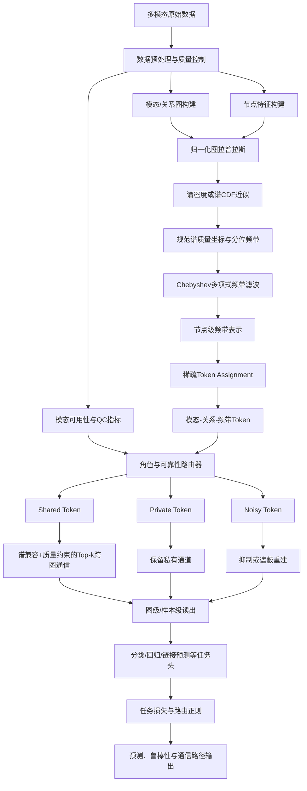

# 1. 项目要解决的问题

## 1.1 问题定义

本项目研究的对象是由多个模态、多个关系分别构造出的**异构多模态多图系统**。

对受试者或样本 $s$，模态 $m$ 和关系类型 $r$ 对应一张图：

$$
G_s^{(m,r)}
=
\left(
V_s^{(m,r)},
A_s^{(m,r)},
X_s^{(m,r)}
\right),
$$

其中：

- $V_s^{(m,r)}$：节点集合；
- $A_s^{(m,r)}$：邻接矩阵或边权矩阵；
- $X_s^{(m,r)}$：节点特征；
- 不同模态或关系图可以具有不同的边、边权、密度、连通性和频谱。

例如，在 MRI 场景中：

- T1/sMRI 图描述脑区形态或空间邻接；
- DTI/dMRI 图描述白质纤维结构连接；
- rs-fMRI 图描述功能相关或偏相关连接。

这些图可能共享脑区节点，但它们的边结构及物理含义不同，因此不应被简单视为同一张图上的多个通道。

## 1.2 现有方法面临的主要问题

### 问题一：不同图上的“低频”和“高频”不能直接横向比较

图信号频率由图拉普拉斯矩阵的特征值和特征向量定义。对图 $G$，归一化拉普拉斯为：

$$
L=I-D^{-1/2}AD^{-1/2}.
$$

当两张图的拓扑、密度或边权不同，它们对应的 $L$ 也不同，特征值分布会发生变化。因此：

- 图 A 中特征值区间 $[0,0.3]$ 可能覆盖大量谱成分；
- 图 B 中相同区间可能只覆盖很少的谱成分；
- 直接将两个图的相同原始特征值区间都称作“低频带”，不一定具有可比语义。

这会破坏跨图频带对齐，并使“低频共享、高频私有”一类规则在异构多图中失去稳定依据。

### 问题二：强制融合会混淆共享信息、模态私有信息和噪声

多模态融合通常倾向于把不同模态的特征投影到共同空间并进行对齐。但是不同模态之间并非所有信息都应共享：

- 部分信息是跨模态共同证据；
- 部分信息只在某一模态中有效；
- 部分信息可能源于噪声、伪影、错误构图或缺失模态重建误差。

如果所有信息都进入 dense cross-attention 或统一对齐，可能产生：

- 模态私有判别信息被抹平；
- 低质量模态向其他模态传播噪声；
- 模型出现负迁移；
- 融合权重难以解释。

### 问题三：全节点跨图交互计算量高

假设多张图都包含大量节点，直接在所有节点之间执行跨图注意力，其计算和显存通常随节点数近似二次增长。

这不仅限制模型扩展到更多关系图和更大图，也会让模型把大量计算浪费在低价值或不兼容的节点对上。

### 问题四：模型通常缺少对模态质量和可用性的显式处理

在真实数据中，模态质量并不均衡。

若模型只看到特征，不显式利用质量控制信息，则很难主动降低低质量模态的跨图传播权重。

### 问题五：融合过程难以形成可核查的解释路径

传统融合模型往往只能给出最终注意力矩阵或整体模态权重，无法明确说明：

- 哪个模态；
- 哪种关系图；
- 哪个规范频带；
- 以共享、私有还是噪声角色；
- 与哪些其他图进行了通信。

CanoSPAR 试图将融合路径压缩为可检查的“模态—关系—频带—角色—目标”链路。

## 1.3 项目的核心解决思路

CanoSPAR 将问题拆成两个核心步骤：

1. **规范谱质量坐标**：先把不同图上的原始特征值映射到统一的谱质量分位坐标，使不同拉普拉斯上的频带获得更稳定的相对位置；
2. **角色条件稀疏 token 路由**：再把各图各频带的信息压缩为少量 token，判断其属于 shared、private 或 noisy，并仅允许可靠且兼容的 shared token 进行 top-$k$ 跨图通信。

---

# 2. 项目框架概览

## 2.1 总体流程图



## 2.2 分模块概览

| 模块 | 名称 | 核心作用 | 主要输出 |
|---|---|---|---|
| M0 | 数据协议与任务定义 | 固定数据拆分、任务、构图规则和防泄漏边界 | 数据清单、拆分索引、配置文件 |
| M1 | 多模态多关系图构建 | 将不同模态转换为具有独立拓扑的图 | $G^{(m,r)}=(V,A,X)$ |
| M2 | 图谱统计与质量描述 | 计算拉普拉斯、图密度、连通性、谱统计和 QC | $L$、谱统计、质量向量 |
| M3 | 规范谱质量坐标 | 将原始特征值转为图内谱分位坐标 | $u=F_L(\lambda)$ |
| M4 | 规范频带图滤波 | 从各规范频带提取节点表示 | $Z^{(m,r,b)}$ |
| M5 | 频带 Token 化 | 把节点级频带表示压缩为少量摘要 token | $H^{(m,r,b)}$ |
| M6 | 角色判定与可靠性建模 | 判断 token 是 shared、private 还是 noisy | $\pi_{\text{shared/private/noisy}}$ |
| M7 | 稀疏跨图路由 | 仅在兼容且可靠的 shared token 间通信 | $\widetilde H$、路由边 |
| M8 | 读出与训练目标 | 聚合共享与私有证据并完成下游预测 | 预测结果与总损失 |
| M9 | 理论、实验与解释 | 验证稳定性、效率、鲁棒性和解释一致性 | 实验表、曲线、路由图 |

## 2.3 两条数据验证路径

CanoSPAR 使用两类场景验证同一套方法。

### 实验路径 A：多模态 MRI

- T1/sMRI：形态学和空间关系；
- DTI/dMRI：结构连接；
- rs-fMRI：功能连接；
- 可增加正边、负边、偏相关或动态窗等关系图。

该路径用于验证不同生物物理机制产生的天然异构图是否能被同一框架联合建模。

### 备用路径 B：通用多模态图

- 电商：商品共购图、文本语义图、图像语义图；
- 社交：帖子回复图、文本相似图、图像相似图；
- 视频：共看图、封面图像图、描述文本图；
- 图书：共收藏图、封面图像图、简介文本图。

该路径用于验证方法是否具有通用多图学习能力。

---

# 3. 核心创新点


## 3.1 核心创新一：面向不同拉普拉斯的规范谱质量坐标

现有谱图方法通常在一张图的拉普拉斯谱上定义滤波器；部分多模态图方法也会分解频带，但其比较往往隐含“多个模态共享同一拓扑或同一谱轴”的假设。

CanoSPAR 的关键变化是：

$$
u=F_L(\lambda)\in[0,1],
$$

其中 $F_L$ 是当前图的经验谱分布函数。原始特征值 $\lambda$ 被映射为其在当前图谱分布中的累计质量位置。

因此，规范频带不再表示固定特征值范围，而表示固定的谱质量分位区间。例如：

- $u\in[0,0.25]$：当前图最靠近谱低端的 25% 谱成分；
- $u\in[0.75,1]$：当前图最靠近谱高端的 25% 谱成分。

这一设计解决的是**跨不同拉普拉斯比较相对频率角色**的问题。

## 3.2 核心创新二：shared/private/noisy 三角色频带 token

每个 token 不是仅由模态产生，而是由：

$$
(\text{模态 }m,\ \text{关系 }r,\ \text{规范频带 }b)
$$

共同定义。

路由器输出：

$$
\pi^{(m,r,b)}
=
[
\pi_{\mathrm{shared}},
\pi_{\mathrm{private}},
\pi_{\mathrm{noisy}}
].
$$

三种角色的职责明确区分：

- **shared**：允许参与跨图语义交换；
- **private**：保留在本图或本模态中，进入最终读出，但不强制对齐；
- **noisy**：被抑制、降权或参与遮蔽重建，不主动传播。

这一结构比单一融合权重更细，因为它允许同一模态的不同关系和不同频带承担不同角色。

## 3.3 核心创新三：谱兼容性与质量共同约束的稀疏通信

CanoSPAR 不在所有 token 之间执行 dense attention，而是根据以下因素筛选路由：

- token 语义相似度；
- 规范频带中心差异；
- 图质量与模态 QC；
- shared 角色概率；
- top-$k$ 邻居约束。

示意打分为：

$$
a_{ij}
=
\frac{q(H_i)^\top k(H_j)}{\sqrt d}
-\lambda_u|u_i-u_j|
-\lambda_q d_{\mathrm{quality}}(i,j).
$$

这样可以避免：

- 频带角色明显不兼容的 token 强行交互；
- 低质量模态向其他图大规模传播；
- 所有 token 两两通信带来的冗余计算。

## 3.4 核心创新四：将数据质量纳入融合决策

模型不仅利用深度特征，还显式接收：

- 图密度、平均度、连通分量数；
- 谱熵、Dirichlet 能量、扩散统计；
- 模态是否缺失；
- 模型不确定性；
- MRI 中的头动、tSNR、纤维追踪成功率和分割 QC。

因此，质量控制不再只是训练前删除数据的工具，也成为运行时路由条件。

## 3.5 核心创新五：可追踪的频带级通信解释

模型能够输出不同模态之间的 token 共享：

$$
(m_i,r_i,b_i)
\rightarrow
(m_j,r_j,b_j),
$$

并同时给出：

- source token 的 shared 概率；
- 路由权重；
- 两者规范频带差异；
- 质量惩罚；
- 路由在不同折、不同随机种子和不同图扰动下的稳定性。

---

# 4. 各模块详细说明

# 4.1 M0：数据协议与任务定义

## 这一模块在做什么

在训练模型之前，先把“使用哪些数据、如何拆分、如何构图、预测什么、哪些步骤不能查看测试集”固定下来，防止后续结果无法复现或发生数据泄漏。

## 输入

- 原始多模态数据；
- 标签或回归目标；
- 受试者、站点、家庭（若可用）、时间或官方去亲缘 cohort 等分组与队列信息；
- 模态可用性；
- 原始 QC 指标。

## 主要处理

1. 明确节点级、边级或图级任务；
2. 固定训练、验证、测试拆分；
3. 对家庭或站点相关数据执行 group-aware split；若家庭标识不可用，则 HCP 正式实验必须使用官方预定义的 unrelated cohort，并在冻结 cohort 后执行受试者级拆分；
4. 所有数据驱动参数仅在训练集拟合；
5. 固定构图参数、编码器版本和随机种子；
6. 保存数据版本、配置文件和缓存哈希。

## 输出

- `splits/*.json`；
- `dataset_manifest.csv`；
- `graph_protocol.yaml`；
- `qc_protocol.yaml`；
- 可复现的数据检查报告。

## 通过标准

- 任一测试样本不参与归一化、阈值、特征选择或 harmonization 参数拟合；
- 每个样本的模态、图、标签和拆分索引可追踪；
- 相同配置可重新生成相同图缓存；
- 若 HCP 不使用 Restricted Access，正式样本必须全部属于冻结的官方 unrelated 名单，且名单版本、来源与哈希可追踪；不得对可能含亲属的完整队列直接随机拆分并作为主结果。

---

# 4.2 M1：多模态多关系图构建

## 这一模块在做什么

把每种模态转换为一张或多张具有明确物理或语义含义的图，而不是把全部模态硬塞进同一邻接矩阵。

## 通用多模态图构建

对共享节点集合，可以分别构造：

1. **原始关系图**
   如 co-purchase、reply、co-view、co-shelving；
2. **文本语义图**
   使用冻结文本编码器提取向量，再构造 kNN 图；
3. **图像语义图**
   使用冻结视觉编码器提取向量，再构造 kNN 图；
4. **元数据关系图**
   基于类别、时间、作者、品牌等不含标签的元数据构图。

关键限制：

- 不使用预测标签构图；
- kNN 的 $k$、距离度量和编码器版本需固定；
- 需要报告不同 $k$ 和不同图密度下的敏感性；
- 必须保存边列表和构图配置。

## MRI 图构建

### T1/sMRI 图

**节点**：脑区 ROI。
**节点特征**：

- 皮层厚度；
- 表面积；
- 灰质体积；
- 曲率；
- 其他 ROI 形态学指标。

**关系图**可包括：

- atlas 空间邻接；
- 个体内形态相似图；
- 基于解剖距离的稀疏图。

### DTI/dMRI 图

**节点**：与 T1 和 fMRI 对齐的 ROI。
**边**可包括：

- streamline 数量；
- SIFT2 权重；
- FA 加权连接；
- MD 加权连接。

**节点特征**可包括：

- FA、MD、AD、RD；
- 区域白质连接统计；
- 节点结构网络统计。

### rs-fMRI 图

**节点**：同一 atlas 下的 ROI。
**边**可包括：

- Pearson correlation；
- partial correlation；
- 正相关图；
- 负相关图；
- 动态窗口 FC 图。

**节点特征**可包括：

- ROI 时序统计；
- ALFF/fALFF；
- ReHo；
- 动态状态摘要；
- 图结构统计。

## 输出

$$
\mathcal G_s
=
\left\{
G_s^{(m,r)}
\right\}_{m,r}.
$$

同时输出每张图的元数据：

```yaml
subject_id:
modality:
relation:
num_nodes:
num_edges:
density:
weighted:
signed:
construction_config:
qc_summary:
cache_hash:
```

## 通过标准

- 每条边均能追溯到明确构图规则；
- 不同模态的节点映射关系明确；
- 图中不存在 NaN、无效边或未记录的自环处理；
- 图密度、连通性和权重分布完成可视化检查。

---

# 4.3 M2：图拉普拉斯、谱统计与质量向量

## 这一模块在做什么

为每张图建立谱域分析所需的数学对象，并生成后续路由器使用的质量描述。

## 归一化拉普拉斯

$$
L=I-D^{-1/2}AD^{-1/2}
$$

对于有符号图、非对称图或存在孤立节点的情况，需要在实现协议中明确：

- 是否拆分正负关系；
- 是否对称化；
- 是否添加自环；
- 孤立节点如何处理；
- 边权是否归一化或截断。

将 fMRI 正边和负边作为不同关系图。

## 图结构统计

建议计算：

- 节点数与边数；
- 图密度；
- 平均度和度分布；
- 连通分量数；
- clustering coefficient；
- 谱半径近似；
- 谱熵；
- Dirichlet 能量；
- 扩散时间统计。

## 质量向量

对 token $i$，可构造质量向量：

$$
q_i=
[
q_{\mathrm{graph}},
q_{\mathrm{modality}},
q_{\mathrm{availability}},
q_{\mathrm{uncertainty}}
].
$$
## 输出

- 归一化拉普拉斯 $L$；
- 缩放拉普拉斯 $\widetilde L$；
- 谱统计；
- 图质量向量；
- 模态可用性掩码。

---

# 4.4 M3：Canonical Spectral Mass Coordinate

## 这一模块在做什么

不再用所有图共用的原始特征值区间划分频带，而是根据每张图自己的谱分布，将频率转换为“在本图中处于第几分位”。

## 经验谱分布

设 $L$ 的特征值为：

$$
0\leq \lambda_1\leq\cdots\leq\lambda_n,
$$

定义经验谱分布函数：

$$
F_L(\lambda)
=
\frac{1}{n}
\sum_{i=1}^{n}
\mathbf 1[\lambda_i\leq\lambda].
$$

规范谱质量坐标为：

$$
u=F_L(\lambda)\in[0,1].
$$

## 规范频带

给定分位边界：

$$
0=\tau_0<\tau_1<\cdots<\tau_B=1,
$$

第 $b$ 个频带定义为：

$$
\mathcal B_b
=
\{\lambda:
\tau_{b-1}\leq F_L(\lambda)<\tau_b\}.
$$

例如 $B=4$ 时：

- Band 1：$u\in[0,0.25)$；
- Band 2：$u\in[0.25,0.5)$；
- Band 3：$u\in[0.5,0.75)$；
- Band 4：$u\in[0.75,1]$。

---

# 4.5 M4：规范频带图滤波

## 这一模块在做什么

从每个规范频带中提取节点信号，形成“低分位频带、中间频带、高分位频带”的节点级表示。

## 频带滤波器

理想滤波器可写为：

$$
g_b(\lambda)
=
\mathbf 1[
\tau_{b-1}\leq F_L(\lambda)<\tau_b
].
$$

但理想矩形滤波器不易直接计算，也可能产生 Gibbs 现象。因此使用平滑频带窗口并进行多项式近似。

## Chebyshev 近似

将拉普拉斯缩放到 $[-1,1]$：

$$
\widetilde L
=
\frac{2L}{\lambda_{\max}}-I.
$$

第 $b$ 个频带的节点表示为：

$$
Z_b
=
\sum_{k=0}^{K}
\theta_{bk}
T_k(\widetilde L)X,
$$

其中：

- $T_k$ 为第 $k$ 阶 Chebyshev 多项式；
- $K$ 为滤波器阶数；
- $\theta_{bk}$ 为频带滤波器系数。

递推计算：

$$
T_0(\widetilde L)X=X,
$$

$$
T_1(\widetilde L)X=\widetilde L X,
$$

$$
T_k(\widetilde L)X
=
2\widetilde L T_{k-1}(\widetilde L)X
-
T_{k-2}(\widetilde L)X.
$$

该过程不需要显式计算全部特征向量。

## 输出

$$
Z_s^{(m,r,b)}
\in
\mathbb R^{|V|\times d}.
$$

## 验证方式

- 对小图比较多项式滤波与精确谱滤波；
- 可视化每个滤波器的频率响应；
- 检查频带间泄漏；
- 比较不同阶数 $K$ 的误差与时间；
- 检查边扰动前后的表示变化。

---

# 4.6 M5：频带 Token 化

## 这一模块在做什么

把每张图每个频带上的大量节点表示，压缩为少量具有全局或局部语义的 token，使跨图通信不再直接发生在所有节点之间。

## 稀疏分配矩阵

对频带节点表示 $Z^{(m,r,b)}$，学习分配矩阵：

$$
S^{(m,r,b)}
\in
\mathbb R^{|V|\times p},
$$

其中 $p$ 是每个频带的 token 数。

token 表示为：

$$
H^{(m,r,b)}
=
S^{(m,r,b)\top}
Z^{(m,r,b)}.
$$

可以使用：

- sparsemax；
- $\alpha$-entmax；
- 稀疏 assignment；
- 带熵或覆盖约束的 soft assignment。

## Token 元数据

每个 token 附带：

```text
modality_id
relation_id
band_id
band_center
band_width
graph_quality
modality_availability
assignment_sparsity
uncertainty
```

## 防止 Token 退化

需要考虑三类退化：

1. **全部节点分到同一 token**；
2. **多个 token 学到相同表示**；
3. **部分 token 永远为空**。

可加入：

- token 使用率约束；
- assignment 熵约束；
- token 间去相关；
- 最小覆盖率；
- 跨 batch 使用率监控。

## 输出

$$
H_s^{(m,r,b)}
\in
\mathbb R^{p\times d}.
$$

## 通过标准

- token 数显著少于节点数；
- assignment 具有实际稀疏性；
- 不同 token 的表示和覆盖节点存在差异；
- 在节点置换后，token 集合或图级表示保持不变。

---

# 4.7 M6：角色判定与可靠性建模

## 这一模块在做什么

判断一个 token 应当参与跨图共享、保留为模态私有信息，还是被视为低质量信息。

## 路由器输入

$$
r_i=
[
H_i,
u_i,
\Delta u_i,
e_i,
q_i,
a_i
],
$$

其中：

- $H_i$：token 表示；
- $u_i$：规范频带中心；
- $\Delta u_i$：频带宽度；
- $e_i$：谱熵、Dirichlet 能量等谱统计；
- $q_i$：图和模态质量；
- $a_i$：模态可用性及不确定性。

## 角色概率

$$
\pi_i
=
\operatorname{softmax}
(
\operatorname{MLP}(r_i)
)
$$

或使用 entmax 得到更稀疏的角色分配：

$$
\pi_i
=
[
\pi_i^{\mathrm{shared}},
\pi_i^{\mathrm{private}},
\pi_i^{\mathrm{noisy}}
].
$$

## 三角色行为

### Shared

- 可以向其他图发送信息；
- 可以接收兼容 token 信息；
- 受到 top-$k$、频带兼容和质量约束。

### Private

- 不强制与其他模态对齐；
- 保留进入最终读出；
- 用于保存模态专有判别信息。

### Noisy

- 在主预测路径中降权；
- 可用于遮蔽重建目标；
- 污染实验中应随噪声上升而增加概率。

## 防塌缩约束

若不加约束，路由器可能把所有 token 都标为 shared 或 private。可使用：

- 角色先验或使用率约束；
- batch-level balance；
- 路由熵调节；
- shared/private 去相关；
- 模态污染增强；
- modality dropout；
- noisy 监督信号或弱监督一致性。

## 输出

- 角色概率；
- token 可靠性；
- 角色使用率统计；
- 路由塌缩告警。

---

# 4.8 M7：Role-Conditioned Sparse Token Routing

## 这一模块在做什么

仅让 shared 概率高、谱角色相近、质量可靠的 token 发生跨图通信，并通过 top-$k$ 限制每个 token 的通信对象数量。

## 路由打分

对 token $i$ 和 $j$：

$$
a_{ij}
=
\frac{q(H_i)^\top k(H_j)}{\sqrt d}
-\lambda_u |u_i-u_j|
-\lambda_q d_{\mathrm{quality}}(i,j)
-\lambda_r d_{\mathrm{relation}}(i,j).
$$

随后仅保留：

$$
j\in\operatorname{TopK}(a_i).
$$

## 信息更新

$$
\widetilde H_i
=
H_i
+
\pi_i^{\mathrm{shared}}
\sum_{j\in\operatorname{TopK}(a_i)}
\alpha_{ij}
\pi_j^{\mathrm{shared}}
W_vH_j.
$$

其中 $\alpha_{ij}$ 是在 top-$k$ 集合内归一化的权重。

## 可选约束

- 禁止同一图内部路由，只保留跨图边；
- 允许同模态不同关系通信；
- 允许不同模态同关系角色通信；
- 设置 relation compatibility mask；
- 对低质量 token 设置最大出边数；
- 使用直通估计或连续 top-$k$ 近似。

## 输出

- 更新后的 token；
- 稀疏路由邻接矩阵；
- 每条路由边的语义分数、频带惩罚和质量惩罚；
- 路由稀疏率。

## 通过标准

- 路由图明显稀疏于 dense attention；
- 某一模态污染后，其出边数或 shared route mass 下降；
- 保留 private 通道时，干净模态性能不因对齐而显著受损；
- 路由在多个随机种子下具有可接受稳定性。

---

# 4.9 M8：图级读出与任务头

## 这一模块在做什么

把完成跨图通信的 shared token、保留的 private token 以及必要的全局统计聚合成样本级表示，用于下游任务。

## 聚合表示

可以定义：

$$
h_{\mathrm{shared}}
=
\operatorname{Pool}
(
\{\widetilde H_i\}
),
$$

$$
h_{\mathrm{private}}
=
\operatorname{Pool}
(
\{\pi_i^{\mathrm{private}}H_i\}
),
$$

$$
h_{\mathrm{global}}
=
[
h_{\mathrm{shared}};
h_{\mathrm{private}};
h_{\mathrm{quality}}
].
$$

## 任务头

### 分类

$$
\hat y
=
\operatorname{softmax}
(
\operatorname{MLP}(h_{\mathrm{global}})
).
$$

### 回归

$$
\hat y
=
\operatorname{MLP}(h_{\mathrm{global}}).
$$

### 节点分类或链接预测

若任务需要节点级输出，应保留 token 到节点的反投影或在图编码阶段输出节点表示，避免只保留图级读出。

## 输出

- 预测结果；
- 置信度和校准指标；
- shared/private 表示；
- 频带级贡献和路由图。

---

# 4.10 M9：理论、实验与解释模块

## 这一模块在做什么

证明或验证模型不是只在某一次实验上有效，而是在节点置换、图扰动、模态缺失和规模变化下具有可解释的行为。

## 主要内容

1. 节点置换等变性或不变性；
2. 多项式滤波近似误差；
3. 谱 CDF 近似误差；
4. 拓扑扰动稳定性；
5. 稀疏路由复杂度；
6. 负迁移控制；
7. 路由稳定性；
8. 模态污染响应；
9. 缺失模态鲁棒性；
10. 计算效率。

---

# 5. 训练目标与模型输出

## 5.1 总损失

主损失建议保持精简：

$$
\mathcal L
=
\mathcal L_{\mathrm{task}}
+
\lambda_{\mathrm{route}}\mathcal L_{\mathrm{route}}
+
\lambda_{\mathrm{private}}\mathcal L_{\mathrm{decor}}
+
\lambda_{\mathrm{mask}}\mathcal L_{\mathrm{mask}}.
$$

## 5.2 各损失项

### 任务损失

分类：

$$
\mathcal L_{\mathrm{task}}
=
\operatorname{CE}(y,\hat y).
$$

回归：

$$
\mathcal L_{\mathrm{task}}
=
\operatorname{MSE}(y,\hat y)
\quad\text{或}\quad
\operatorname{Huber}(y,\hat y).
$$

### 路由损失

可包含：

- shared 路由一致性；
- top-$k$ 稀疏性；
- 角色使用率；
- 路由熵；
- 防塌缩约束；
- 污染增强下的可靠性排序。

### Shared/Private 去相关

可使用交叉协方差惩罚：

$$
\mathcal L_{\mathrm{decor}}
=
\left\|
\frac{1}{N}
H_{\mathrm{shared}}^\top
H_{\mathrm{private}}
\right\|_F^2.
$$

其目标是减少共享表示和私有表示的重复编码，而不是要求二者完全独立。

### 遮蔽重建

随机遮蔽：

- 模态；
- 关系图；
- 节点；
- 边；
- token。

模型需要恢复被遮蔽表示或维持任务预测，从而提高缺失模态鲁棒性。

## 5.3 模型最终输出

除预测结果外，模型应同时保存：

- 每个 token 的角色概率；
- 每个 token 的规范频带；
- top-$k$ 路由边；
- 路由质量惩罚；
- shared/private/noisy route mass；
- 模态缺失或污染下的路由变化；
- 计算时间和显存；
- 训练配置和随机种子。

---
# 6. 总结

CanoSPAR 面向的是一种比普通多模态融合更严格的问题设定：不同模态和不同关系分别形成具有独立拓扑、独立拉普拉斯和独立谱密度的图。

项目的核心逻辑是：

1. 对每张图构造归一化拉普拉斯；
2. 估计图特异的谱分布；
3. 将原始频率映射为规范谱质量坐标；
4. 按谱分位构建可比较的频带；
5. 使用 Chebyshev 多项式提取频带节点表示；
6. 将节点表示压缩为模态—关系—频带 token；
7. 把 token 判定为 shared、private 或 noisy；
8. 仅在可靠且谱角色兼容的 shared token 间执行 top-$k$ 跨图通信；
9. 保留 private 信息，抑制 noisy 信息；
10. 通过合成数据、通用多模态图和 T1/DTI/rs-fMRI 验证机制、性能、鲁棒性、效率和解释稳定性。

该项目真正需要验证的是以下四个因果链条是否成立：

- 不同拉普拉斯上的固定原始频带确实存在不可比问题；
- 规范谱质量坐标能够提高频带角色对应的稳定性；
- shared/private/noisy 路由能够减少不必要的跨模态对齐和噪声传播；
- 稀疏 token 通信能够在保持有效信息交换的同时降低计算开销。

若这四条链条能够分别通过可控实验、消融和理论分析得到支持，CanoSPAR 将形成一套结构清晰、可实现、可解释且可扩展的异构多模态多图学习框架。

---

# 参考文献

## A. 图信号处理、谱图卷积与谱估计

[1] Shuman, D. I., Narang, S. K., Frossard, P., Ortega, A., & Vandergheynst, P. **The Emerging Field of Signal Processing on Graphs: Extending High-Dimensional Data Analysis to Networks and Other Irregular Domains.** IEEE Signal Processing Magazine, 2013.
https://doi.org/10.1109/MSP.2012.2235192

[2] Defferrard, M., Bresson, X., & Vandergheynst, P. **Convolutional Neural Networks on Graphs with Fast Localized Spectral Filtering.** NeurIPS, 2016.
https://arxiv.org/abs/1606.09375

[3] He, M., Wei, Z., & Wen, J.-R. **Convolutional Neural Networks on Graphs with Chebyshev Approximation, Revisited.** NeurIPS, 2022.
https://arxiv.org/abs/2202.03580
代码：https://github.com/ivam-he/ChebNetII

[4] Ubaru, S., Chen, J., & Saad, Y. **Fast Estimation of $tr(f(A))$ via Stochastic Lanczos Quadrature.** SIAM Journal on Matrix Analysis and Applications, 2017.
https://doi.org/10.1137/16M1104974
代码：https://github.com/Shashankaubaru/SLQ

[5] Chen, T., Trogdon, T., & Ubaru, S. **Analysis of Stochastic Lanczos Quadrature for Spectrum Approximation.** ICML, 2021.
https://arxiv.org/abs/2105.06595

[6] Braverman, V., Krishnan, A., & Musco, C. **Sublinear Time Spectral Density Estimation.** STOC, 2022 / arXiv 2021.
https://arxiv.org/abs/2104.03461

[7] Gama, F., Bruna, J., & Ribeiro, A. **Stability of Graph Neural Networks to Relative Perturbations.** ICASSP / arXiv, 2020.
https://arxiv.org/abs/1910.09655

## B. 稀疏概率、Token 与图池化

[8] Martins, A. F. T., & Astudillo, R. F. **From Softmax to Sparsemax: A Sparse Model of Attention and Multi-Label Classification.** ICML, 2016.
https://proceedings.mlr.press/v48/martins16.html

[9] Peters, B., Niculae, V., & Martins, A. F. T. **Sparse Sequence-to-Sequence Models.** ACL, 2019.
https://arxiv.org/abs/1905.05702
代码：https://github.com/deep-spin/entmax

[10] Ying, Z., You, J., Morris, C., Ren, X., Hamilton, W. L., & Leskovec, J. **Hierarchical Graph Representation Learning with Differentiable Pooling.** NeurIPS, 2018.
https://arxiv.org/abs/1806.08804

## C. 多模态属性图与相关方法

[11] Yan, H., Li, C., Yu, Z., et al. **When Graph Meets Multimodal: Benchmarking on Multimodal Attributed Graphs Learning.** 2024.
https://arxiv.org/abs/2410.09132
代码：https://github.com/sktsherlock/MAGB

[12] Zhu, J., Zhou, Y., Qian, S., et al. **Multimodal Graph Benchmark.** 2024.
https://arxiv.org/abs/2406.16321
项目页：https://mm-graph-benchmark.github.io/

[13] Wan, C., Li, X., Zuo, Y., et al. **OpenMAG: A Comprehensive Benchmark for Multimodal-Attributed Graph.** 2026.
https://arxiv.org/abs/2602.05576
代码：https://github.com/YUKI-N810/OpenMAG

[14] Wu, Z., Wang, X., Qin, H., et al. **SMGFM: Spectral Multimodal Graph Pretraining for Multimodal-Attributed Graphs.** 2026.
https://arxiv.org/abs/2606.12867

[15] Hong, X., Lin, M., Wang, X., Wang, C., & Li, W. **Multimodal Graph Representation Learning with Dynamic Information Pathways.** 2026.
https://arxiv.org/abs/2603.09258

[16] He, Y., Sui, Y., He, X., Liu, Y., Sun, Y., & Hooi, B. **UniGraph2: Learning a Unified Embedding Space to Bind Multimodal Graphs.** WWW, 2025.
https://arxiv.org/abs/2502.00806
代码：https://github.com/yf-he/UniGraph2

[17] Wu, S., Cao, K., Ribeiro, B., Zou, J., & Leskovec, J. **GraphMETRO: Mitigating Complex Graph Distribution Shifts via Mixture of Aligned Experts.** NeurIPS, 2024.
https://arxiv.org/abs/2312.04693
代码：https://github.com/Wuyxin/GraphMETRO

## D. 脑图学习与多模态 MRI

[18] Cui, H., Dai, W., Zhu, Y., et al. **BrainGB: A Benchmark for Brain Network Analysis with Graph Neural Networks.** IEEE Transactions on Medical Imaging, 2023.
https://arxiv.org/abs/2204.07054
项目页：https://braingb.us/

[19] Luo, X., Wu, J., Yang, J., et al. **Graph Neural Networks for Brain Graph Learning: A Survey.** IJCAI, 2024.
https://arxiv.org/abs/2406.02594
资料库：https://github.com/XuexiongLuoMQ/Awesome-Brain-Graph-Learning-with-GNNs

[20] Zhang, X. S., He, L., Chen, K., Luo, Y., Zhou, J., & Wang, F. **Multi-View Graph Convolutional Network and Its Applications on Neuroimage Analysis for Parkinson's Disease.** AMIA, 2018.
https://arxiv.org/abs/1805.08801

[21] Li, X., Zhou, Y., Dvornek, N., et al. **BrainGNN: Interpretable Brain Graph Neural Network for fMRI Analysis.** Medical Image Analysis, 2021.
https://pubmed.ncbi.nlm.nih.gov/34655865/
代码：https://github.com/xxlya/BrainGNN_Pytorch

[22] Qu, G., Zhou, Z., Calhoun, V. D., Zhang, A., & Wang, Y.-P. **Integrated Brain Connectivity Analysis with fMRI, DTI, and sMRI Powered by Interpretable Graph Neural Networks.** 2024.
https://arxiv.org/abs/2408.14254

[23] Bessadok, A., Mahjoub, M. A., & Rekik, I. **Graph Neural Networks in Network Neuroscience.** IEEE Transactions on Pattern Analysis and Machine Intelligence / arXiv survey.
https://arxiv.org/abs/2106.03535

## E. 工程框架与文档

[24] Fey, M., & Lenssen, J. E. **Fast Graph Representation Learning with PyTorch Geometric.** ICLR Workshop, 2019.
https://arxiv.org/abs/1903.02428
代码：https://github.com/pyg-team/pytorch_geometric

[25] PyTorch Geometric. **ChebConv Documentation.**
https://pytorch-geometric.readthedocs.io/en/latest/generated/torch_geometric.nn.conv.ChebConv.html

[26] OpenMAG GitHub Repository.
https://github.com/YUKI-N810/OpenMAG

[27] MAGB GitHub Repository.
https://github.com/sktsherlock/MAGB

[28] Entmax PyTorch Implementation.
https://github.com/deep-spin/entmax

[29] SLQ Reference Implementation.
https://github.com/Shashankaubaru/SLQ

## F. HCP 数据协议与泄漏控制

[30] Human Connectome Project. **HCP-Young Adult 2025 Release.** 2025.
https://www.humanconnectome.org/study/hcp-young-adult/document/hcp-young-adult-2025-release

[31] Human Connectome Project Public Pages. **S900 Unrelated Subjects CSV.**
https://wiki.humanconnectome.org/docs/S900%20Unrelated%20Subjects%20CSV.html

[32] Rosenblatt, M., Tejavibulya, L., Jiang, R., et al. **Data leakage inflates prediction performance in connectome-based machine learning models.** Nature Communications, 2024.
https://doi.org/10.1038/s41467-024-46150-w

[33] DataLad Datasets. **human-connectome-project-openaccess**（旧 HCP1200/S1200 数据检索仓库，仅作工程参考，不作为 HCP-YA 2025 主数据源）.
https://github.com/datalad-datasets/human-connectome-project-openaccess
