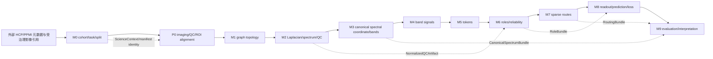

# CanoSPAR 模块协议说明书 v1.1

**文档版本：** `1.1.0`<br>
**架构契约版本：** `1.0.0`<br>
**科学契约版本：** `1.1.0`<br>
**Schema 版本：** `1.0.0`<br>
**RuntimeProfile 版本：** `1.0.0`<br>
**NumericsProfile Schema 版本：** `1.0.0`<br>
**状态：** FROZEN FOR IMPLEMENTATION<br>
**适用范围：** P0、M0、M1、M2、M3、M4、M5、M6、M7、M8、M9，以及它们之间的 L0-L4 契约边界。

本文档是后续模块实现的接口依据。已有实现、契约占位和未实现模块都必须遵守本文档；“CONTRACT_ONLY”只能表示接口已冻结，不能表示算法已经实现或科学结果已经验证。

## 0. v1.1.0 修订说明

本版本在 M2/M3 正式实现前修复 v1.0.0 中会导致接口歧义、数据泄漏风险或 M4 无法无歧义对接的问题。架构 DAG、科学任务、cohort/split 规则和 M0/P0/M1 source-of-truth 不变。

本次冻结的修订只有以下五类：

1. **M2 QC fitted state 可表达完整变换。** `FittedQCState` 从每特征两个标量改为四个标量，固定表示训练折中位数/填充值、winsor 下界、winsor 上界和 robust scale；缺失只允许以“key 缺失”表示，不允许 NaN/Inf 穿过契约边界。
2. **M2 禁止隐式重新拟合 QC。** `run_m2` 只能消费已经由训练 partition 拟合的 `FittedQCState`；未提供 state 时允许 `SpectralBundle.normalized_qc=None`，不得对验证/测试样本自行 fit。
3. **M3 规范坐标改为 tie-aware empirical mid-CDF。** 唯一特征值时严格退化为计划书的 `u_i=(i-0.5)/N`；重复特征值属于同一退化 eigenspace 时共享同一个 mid-CDF 坐标，禁止按任意 eigenvector/rank 顺序拆开。
4. **M3/M4 频带边界所有权明确。** M3 只冻结 mass-space 边界；图特异的 `lambda` 过渡点由 M4 从 M3 已冻结坐标和 M2 spectrum 确定性物化，不反向修改 M3。
5. **M4 精确滤波的 eigenvector 使用被限制为 transient numerical basis。** v1.1.0 不修改 `SpectrumArtifact` schema；M4 可从冻结的 `LaplacianArtifact` 临时计算正交 eigenbasis，但必须先验证重算 eigenvalues 与 M2 `SpectrumArtifact` 一致，且不得发布第二份 spectrum source-of-truth。

由于本次不修改正式 artifact 字段，`schema_version` 保持 `1.0.0`；由于 M2-M4 的函数语义和数学约束发生修订，`module_protocol_spec_version` 升级为 `1.1.0`。任何 M2-M9 的 v1.0.0 canonical cache/receipt 均不得直接作为 v1.1.0 cache 命中；M0/P0/M1 不因本修订自动失效。

## 1. 不可违反的规则

1. 代码中的公共模块入口位于 `src/canospar/api/`；数据读取和元数据构建位于 `src/canospar/data/`。
2. 任何跨模块对象必须使用本文档列出的现有类，或使用本文档明确列出的标准数据类型。不得新增一个没有来源和消费者的 `*Artifact` 类。
3. 每个模块的输入必须来自：上游模块产出的类、明确的科学配置类、`ScienceContext`、`RuntimeProfile`/执行对象，或仓库外受治理的真实数据引用。
4. 每个模块的输出必须被下游模块消费，或成为最终实验结果、验证结果、执行收据的一部分。没有消费者的中间产物不得加入接口。
5. 输入和输出对象均为不可变 dataclass、不可变 tuple、只读 mapping 或复制后的 `torch.Tensor`。不得通过模块边界修改上游对象。
6. 下游模块不得重新计算上游 source-of-truth。需要修改上游语义时，必须使对应上游 artifact 失效并重新生成。
7. M4-M9 在当前基线中仍为 `CONTRACT_ONLY`；M2 和 M3 已在满足第 21 节门禁后升级为 `IMPLEMENTED`。任何标记为 `CONTRACT_ONLY` 的模块可以拥有函数、类型和验证器，但不得返回伪造的科学结果。
8. `science_key` 不得包含 CPU/GPU 数量、主机名、服务器类别、Bita、SSH、WebTerminal、调度器并发等运行参数；数值语义变化必须通过 `NumericsProfile` 进入 `reproduction_key`。
9. 真实 HCP/PPMI 原始数据、影像体数据、受限数据、凭据和个人绝对路径不进入 Git。Git 中只保存配置、schema、哈希、聚合报告、合成 fixture 和文档。

## 2. 版本与实现状态

版本命名空间必须保持独立：

| 名称 | 当前值 | 作用 |
| --- | --- | --- |
| `architecture_contract_version` | `1.0.0` | 五层架构和模块边界 |
| `science_contract_version` | `1.1.0` | cohort、任务、拆分、泄漏和数据治理 |
| `module_protocol_spec_version` | `1.1.0` | 本文档冻结的模块输入、输出和函数；v1.1.0 修复 M2-M4 实现前协议歧义 |
| `schema_version` | `1.0.0` | artifact 元数据 schema |
| `runtime_profile_version` | `1.0.0` | 执行位置和资源配置 |
| `numerics_profile_schema_version` | `1.0.0` | 数值语义和可复现性身份 |

允许的 `ImplementationStatus` 来自 `src/canospar/contracts/governance.py`：

| 状态 | 含义 |
| --- | --- |
| `EXISTING` | 既有代码或既有结果已经存在，但仍需通过本协议适配 |
| `PARTIAL` | 部分实现存在，跨模块契约或科学实现尚未完整 |
| `CONTRACT_ONLY` | 只有接口、类型和失败闭合行为，不能声称已实现 |
| `IMPLEMENTED` | 按本文档完成实现并通过模块测试 |
| `VERIFIED` | 在 `IMPLEMENTED` 基础上完成规定的科学验证和复现验证 |

## 3. 模块总图与数据闭合



严格的 source-of-truth 所有权如下：

| 模块 | 唯一 source-of-truth |
| --- | --- |
| M0 | cohort、task、split、leakage boundary、manifest |
| P0 | imaging 输入、ROI 对齐、影像 QC |
| M1 | graph topology、节点顺序、关系和边权 |
| M2 | Laplacian、spectrum、图统计、训练折 QC transform state 与 normalized QC |
| M3 | canonical spectral mass coordinate、band boundaries |
| M4 | band-filtered node signals |
| M5 | token assignment、token 表示和 token 元数据 |
| M6 | shared/private/noisy 角色概率和 reliability |
| M7 | route candidate、route score、最终 route |
| M8 | sample embedding、prediction、loss |
| M9 | evaluation、statistical test、mechanism 和 stability report |

## 4. 类型闭合规则

本文档中的以下名称是**类型别名**，不是新的运行时 class，也不是新的 artifact：

```python
from collections.abc import Mapping, Sequence
from pathlib import Path
import torch

JsonScalar = str | int | float | bool | None
JsonValue = JsonScalar | Sequence[JsonScalar] | Mapping[str, JsonScalar]
JsonObject = Mapping[str, JsonValue]
Tensor = torch.Tensor
QCVector = Mapping[str, float]
AvailabilityMask = Mapping[str, bool]
NodeFeatureMatrix = torch.Tensor       # [num_nodes, feature_dim]
EdgeIndex = torch.Tensor               # [2, num_edges], dtype=torch.long
EdgeWeight = torch.Tensor              # [num_edges], floating dtype
QCFeatureState = tuple[float, float, float, float]
# (impute_median, winsor_low, winsor_high, robust_scale)
FittedQCState = Mapping[str, QCFeatureState]
TokenPair = tuple["TokenKey", torch.Tensor]
RouteEdge = tuple["TokenKey", "TokenKey"]
ScoredRouteEdge = tuple["TokenKey", "TokenKey", float]
```

`JsonObject` 的嵌套值必须是 JSON 可序列化的标准值；如果后续实现需要更复杂的张量或数组，必须使用已有 artifact 类中的 `torch.Tensor` 字段，不能把任意 Python 对象塞进模块接口。

`QCVector` 的值必须是有限 `float`。QC 缺失值在 v1.1.0 中只允许通过“该 feature key 缺失”表示；不得使用 `None`、NaN 或 Infinity 作为跨模块缺失标记。`FittedQCState[feature]` 的四个位置语义固定，不得由实现自行重解释：

```text
0 = impute_median   # 训练 partition 中位数，同时是缺失填充值
1 = winsor_low      # 训练 partition 拟合的 winsor 下界
2 = winsor_high     # 训练 partition 拟合的 winsor 上界
3 = robust_scale    # 训练 partition IQR；退化时按 M2 协议置为 1.0
```

`FittedQCState` 是 M2 内部可序列化 fitted state，不是新的跨模块科学 artifact。任何持久化副本都必须稳定序列化并计算内容 SHA-256；其哈希必须进入消费该 state 的 `NormalizedQCArtifact`/`SpectralBundle` 的 `input_content_hashes`，从而进入 `science_key`，并同时写入 execution receipt。不能只靠文件名或 RuntimeProfile 识别。

当前源码中尚未完成模块的部分字段和函数仍写作 `object`。这些是骨架占位，不是最终协议类型。实现尚未完成的 M4-M9 时，必须将源码注解、运行时校验和测试收敛到本节以及后文的具体类型；在收敛之前，相应模块保持 `CONTRACT_ONLY`。

## 5. 真实数据边界与 M0 输入

### 5.1 HCP 主协议

HCP 主实验使用 HCP-Young Adult 2025 Open Access imaging 的元数据和官方 unrelated-subject list。HCP Restricted Access 未获批准，`Family_ID` 不作为主协议输入。正式 cohort 只能由以下交集冻结：官方 unrelated 名单、模态可用性、target 完整性、QC 结果。

`configs/data/hcp.yaml` 当前冻结的逻辑输入为：

| 逻辑名 | 真实数据格式/位置 | 用途 |
| --- | --- | --- |
| `data_dictionary` | 外部 CSV | 列含义和 target 字典 |
| `unrelated_list` | 外部 CSV | 官方 unrelated whitelist |
| `subject_export` | 外部 CSV | subject、模态完成度、QC 和 target |
| `appendix_2025` | 外部 PDF | release/采集说明 |
| `access_record` | 外部 Markdown/JSON | access/download 记录 |
| `download_record` | 外部 Markdown/JSON | 下载记录 |
| `download_manifest` | 外部 JSON array | 文件名、sha256 和历史记录 |

HCP 当前 task 配置为 regression，primary target 为 `CogFluidComp_Unadj`，secondary targets 为 `CogTotalComp_Unadj` 和 `PMAT24_A_CR`，primary metric 为 MAE。完整 Open Access cohort 只能用于 pipeline 调试，不能直接随机拆分后作为主结果。

### 5.2 PPMI 协议

PPMI 以 `subject_id` 为拆分单位，同一 subject 的所有 visit 必须进入同一 partition。PPMI HCP-specific provenance 字段使用显式 `not_applicable`，不能用缺失值代替。

`configs/data/ppmi.yaml` 当前冻结的逻辑输入为：

| 逻辑名 | 真实数据格式 | 用途 |
| --- | --- | --- |
| `data_dictionary` | 外部 CSV | 临床字段字典 |
| `code_list` | 外部 CSV | 编码值解释 |
| `participant_status` | 外部 CSV | cohort/enrollment |
| `demographics` | 外部 CSV | 人口学与 visit |
| `mds_updrs_part_i_patient` | 外部 CSV | 临床 target 候选 |
| `mds_updrs_part_i_clinician` | 外部 CSV | 临床 target 候选 |
| `mds_updrs_part_ii_patient` | 外部 CSV | 临床 target 候选 |
| `mds_updrs_part_iii_motor` | 外部 CSV | primary target 候选 |
| `mri_completion` / `archived_mri` | 外部 CSV | MRI completion/current/archive |
| `xing_mri_acquisition` | 外部 CSV | acquisition 质量和可用性 |
| `t1_inventory` / `rsfmri_inventory` / `dti_inventory` | 外部 CSV | source inventory |

PPMI target 由 `configs/data/ppmi_targets.yaml` 和 `evaluate_task_gate` 决定。当前审计保留 candidate A（MDS-UPDRS Part III follow-up minus baseline）和 candidate B 作为分支；任何正式实验必须使用 manifest 中冻结的 task selection，不能在 M8/M9 根据结果反向改 target。

### 5.3 影像和 Week 5-7 边界

真实 DICOM、NIfTI、BIDS、fMRIPrep/QSIPrep/FreeSurfer/MRIQC 目录以及服务器运行状态都位于仓库外。P0 只接收经过 manifest、路径治理、哈希和 QC 约束的引用；`ImagingInputBundle.raw_or_derivative_refs` 保存逻辑引用或受治理路径标识，不把真实影像复制进 Git。

Week 5-7 的 archive、extraction、DICOM/BIDS、atlas、QC 是 P0 和 L3 evidence；MRIQC v2 scheduler、monitor、handoff、Bita、SSH、WebTerminal 是 L3/L4 runtime evidence，不是 M2-M9 的科学实现。

## 6. 共享基础类与字段协议

### 6.1 M0 只读 artifact 引用类

这些类定义在 `src/canospar/api/m0.py`，只保存外部结果的引用和内容哈希，不复制真实数据：

| 类 | 字段 | 生产者 | 消费者 |
| --- | --- | --- | --- |
| `DatasetManifestArtifact` | `artifact_ref: str`, `content_hash: str` | M0 manifest adapter | P0、`ScienceContext` |
| `SplitRegistryArtifact` | `artifact_ref: str`, `content_hash: str` | M0 split adapter | P0-M9 的 split/lineage 校验 |
| `TaskDefinitionArtifact` | `artifact_ref: str`, `content_hash: str` | M0 task adapter | P0-M9 的 task/target 校验 |

`artifact_ref` 必须是仓库外真实输入的可追溯引用、Git 中的配置相对路径或受治理 artifact URI；`content_hash` 必须是对应内容的 SHA-256。当前源码只实现了 `load_dataset_manifest`，split/task loader 是 M0 必须补齐的未实现函数，见第 7 节。

### 6.2 既有真实数据类

#### `GraphData`

定义在 `src/canospar/data/contracts.py`，代表一张单模态、单关系图：

| 字段 | 类型和约束 |
| --- | --- |
| `x` | `torch.Tensor`, shape `[num_nodes, num_features]`，浮点且有限 |
| `edge_index` | `torch.Tensor`, shape `[2, num_edges]`，`torch.long`，索引在节点范围内 |
| `edge_weight` | `torch.Tensor`, shape `[num_edges]`，浮点且有限 |
| `num_nodes` | 正整数，等于 `x.size(0)` |
| `modality` | 非空字符串；当前允许 `smri`、`dmri`、`fmri` |
| `relation` | 非空关系名，如 `atlas_adjacency`、`positive_fc`、`fa_weighted` |
| `graph_qc` | 非空 JSON mapping |
| `construction_hash` | 构图规则、配置和输入的哈希 |

冻结方法：`GraphData.validate() -> None`、`GraphData.to_pyg_data() -> torch_geometric.data.Data`。`to_pyg_data` 只能在验证后复制为 PyG `Data`，不能反向替代 `GraphData`。

#### `BrainMultiGraphSample`

定义在 `src/canospar/data/contracts.py`，代表一个 subject visit：

| 字段 | 类型和约束 |
| --- | --- |
| `subject_id`, `visit_id`, `group_id`, `site_id` | 非空字符串 |
| `graphs` | `Mapping[str, Mapping[str, GraphData]]`，外层 modality 为 `smri`/`dmri`/`fmri` |
| `modality_available` | `Mapping[str, bool]`，必须恰好包含三个 modality |
| `qc_vector` | `Mapping[str, float]`，值有限 |
| `target` | 有限 `float | int` |
| `covariates` | `Mapping[str, float | str]` |
| `cohort_metadata` | `Mapping[str, str]`，必须包含 `cohort_source`、`unrelated_list_version`、`kinship_control_method` |

冻结方法：`BrainMultiGraphSample.validate() -> None`。`group_id` 是拆分单位；HCP 主协议中等于 `subject_id`，PPMI 中同样按 `subject_id` 绑定所有 visit。

### 6.3 通用 artifact 类

#### `ArtifactMeta`

定义在 `src/canospar/contracts/base.py`，所有正式科学 artifact 必须携带：

```text
schema_version: str
artifact_type: str
artifact_id: str
producer_module: str
module_contract_version: str
science_contract_version: str
input_artifact_ids: tuple[str, ...]
input_content_hashes: tuple[str, ...]
science_config_hash: str
dataset_manifest_hash: str | None
split_id: str | None
random_seed: int | None
content_sha256: str
implementation_hash: str
numerics_profile_hash: str
created_at_utc: str
```

`input_artifact_ids` 与 `input_content_hashes` 长度必须相等。除 `dataset_manifest_hash`、`split_id`、`random_seed` 外所有字段必须为非空字符串。

#### `ScienceContext`

```text
science_contract_version: str
science_config_hash: str
dataset_manifest_hash: str | None
split_id: str | None
random_seed: int | None
```

它携带科学身份，不携带运行资源。每个 M1-M9 科学函数都必须接收 `ScienceContext`，除 M2/M3 的纯内部数学 helper 外不得省略。

#### 稳定键

| 类 | 字段 | 来源 |
| --- | --- | --- |
| `GraphKey` | `subject`, `visit`, `modality`, `relation` | `BrainMultiGraphSample` + `GraphData` |
| `BandKey` | `graph_key: GraphKey`, `band_id: str` | M3 `BandDefinition` |
| `TokenKey` | `band_key: BandKey`, `token_id: str` | M5 token assignment |

冻结函数：

```python
build_science_key(
    context: ScienceContext,
    input_content_hashes: Sequence[str],
    module_contract_version: str,
    *,
    runtime_profile_id: str | None = None,
) -> str

build_reproduction_key(
    science_key: str,
    implementation_hash: str,
    numerics_profile_hash: str,
) -> str
```

`runtime_profile_id` 在 `build_science_key` 中必须被忽略；它只能写入 `CompletionReceipt`。

### 6.4 影像 artifact 类

#### `ImagingInputBundle`

定义在 `src/canospar/contracts/imaging.py`，由 M0 的 manifest/real-data adapter 产生，供 P0 消费：

```text
subject_id: str
visit_id: str
dataset: str
raw_or_derivative_refs: Mapping[str, str]
modality_available: Mapping[str, bool]
acquisition_metadata: Mapping[str, Any]
source_hashes: Mapping[str, str]
```

`raw_or_derivative_refs` 的 key 必须指向真实来源或 derivative 逻辑名；`source_hashes` 必须覆盖进入 P0 的来源。`acquisition_metadata` 只保存可治理的 JSON 元数据，不保存影像体素。

#### `ROIAlignedSample`

定义在 `src/canospar/contracts/imaging.py`，由 P0 产生，供 M1 消费：

```text
meta: ArtifactMeta
subject_id: str
visit_id: str
atlas_id: str
atlas_hash: str
roi_table_hash: str
node_order_hash: str
modality_payloads: Mapping[str, Mapping[str, torch.Tensor]]
modality_available: Mapping[str, bool]
qc_vector: Mapping[str, float]
qc_status: str
source_artifact_ids: tuple[str, ...]
```

`modality_payloads` 是对现有源码 `Mapping[str, Any]` 的协议收敛：外层 key 为 `smri`、`dmri`、`fmri`，内层 value 是已对齐的 ROI 级 tensor 命名表。M1 不得从原始影像重新选择 ROI 或改变 `node_order_hash`。

### 6.5 M2-M9 artifact 类

下表列出的类都已经存在于 `src/canospar/contracts/`。表中的 tensor、mapping 和 tuple 是字段语义的冻结类型；它们不是新增 class。

| 类 | 字段语义 | 生产者 | 下游/最终用途 |
| --- | --- | --- | --- |
| `LaplacianArtifact` | `meta: ArtifactMeta`; `graph_key: GraphKey`; `payload: torch.Tensor`，方阵 | M2 | `compute_spectrum`、M4 |
| `SpectrumArtifact` | `meta`; `graph_key`; `eigenvalues: torch.Tensor`，升序有限向量 | M2 | M3、M2 statistics |
| `SpectralStatistics` | `meta`; `graph_key`; `values: Mapping[str, float]` | M2 | M6、M9、最终解释 |
| `NormalizedQCArtifact` | `meta`; `values: Mapping[str, float]` | M2 | M6、M9 |
| `SpectralBundle` | `meta`; `laplacians: tuple[LaplacianArtifact, ...]`; `spectra: tuple[SpectrumArtifact, ...]`; `statistics: tuple[SpectralStatistics, ...]`; `normalized_qc: NormalizedQCArtifact | None` | M2 | M3、M4、M9 |
| `CanonicalSpectrumArtifact` | `meta`; `graph_key: GraphKey`; `spectrum_artifact_id: str`; `u_coordinate: torch.Tensor`; `lambda_coordinate: torch.Tensor` | M3 | `CanonicalSpectrumBundle` |
| `BandDefinition` | `band_id`; `lower_mass`, `upper_mass` in `[0,1]`; optional lambda bounds | M3 | M4、M9 |
| `CanonicalSpectrumBundle` | `meta`; `spectra: tuple[CanonicalSpectrumArtifact, ...]`; `bands: tuple[BandDefinition, ...]` | M3 | M4、M9 |
| `BandSignalBundle` | `meta`; `signals: tuple[tuple[BandKey, torch.Tensor], ...]`，tensor 为 `[num_nodes, feature_dim]` | M4 | M5 |
| `TokenBundle` | `meta`; `tokens: tuple[TokenPair, ...]`; `assignment: torch.Tensor`; `token_ids`; JSON `token_metadata`; `token_mass: torch.Tensor`; `assignment_entropy: torch.Tensor` | M5 | M6、M7、M8 |
| `RoleBundle` | `meta`; `token_ids`; `shared_probability`、`private_probability`、`noisy_probability`、`reliability: torch.Tensor` | M6 | M7、M8、M9 |
| `RouteCandidateGraph` | `meta`; `edges: tuple[RouteEdge, ...]` | M7 | `score_routes`、`RoutingBundle` |
| `RouteScoreGraph` | `meta`; `scores: tuple[ScoredRouteEdge, ...]` | M7 | `route_tokens`、`RoutingBundle` |
| `RouteGraph` | `meta`; `edges: tuple[ScoredRouteEdge, ...]` | M7 | `RoutingBundle`、M8、M9 |
| `RoutedTokenBundle` | `meta`; `values: tuple[TokenPair, ...]` | M7 | M8 |
| `RoutingBundle` | `meta`; optional candidates/scores/routes/routed_tokens | M7 | M8、M9 |
| `SampleEmbedding` | `meta`; `shared_embedding`、`private_embedding`、`global_embedding: torch.Tensor | None` | M8 | `PredictionBundle`、M9 |
| `PredictionBundle` | `meta`; `prediction: torch.Tensor`; optional `embedding: SampleEmbedding` | M8 | `LossBundle`、M9 |
| `LossBundle` | `meta`; `values: Mapping[str, float]` | M8 | 最终训练记录、M9/实验报告 |
| `ExperimentRegistry` | `artifact_ref: str`; `registry_hash: str` | M0/实验注册 | M9 |
| `MetricReport` | `meta`; `metrics: Mapping[str, float]` | M9 | `EvaluationBundle`/最终结果 |
| `MechanismReport` | `meta`; `values: JsonObject` | M9 | `EvaluationBundle`/最终结果 |
| `RobustnessReport` | `meta`; `values: JsonObject` | M9 | `EvaluationBundle`/最终结果 |
| `StabilityReport` | `meta`; `values: JsonObject` | M9 | `EvaluationBundle`/最终结果 |
| `StatisticalTestReport` | `meta`; `values: JsonObject` | M9 | `EvaluationBundle`/最终结果 |
| `EvaluationBundle` | `meta`; `reports: tuple[MetricReport | MechanismReport | RobustnessReport | StabilityReport | StatisticalTestReport, ...]` | M9 | 最终 evaluation artifact |

### 6.6 执行和验证类

这些对象属于 L3/L4，不是科学算法输出：

| 类/函数 | 作用 |
| --- | --- |
| `CanonicalStatus` | `PASS`、`READY`、`BLOCKED`、`FAIL`、`INVALIDATED` |
| `CompletionReceipt` | module/version、输入输出 ID/hash、science/reproduction key、runtime profile ID、validator status、时间和 issue codes |
| `ModuleRunResult[_Artifact]` | `canonical_status`、`native_status`、可选 artifact、receipt、`tuple[ValidationIssue, ...]` |
| `RuntimeProfile` | CPU、RAM、GPU、worker、container、scheduler、transport、server 等运行信息 |
| `NumericsProfile` | dtype、precision、deterministic algorithm、线代/eigensolver backend、tolerance、数值库版本 |
| `ValidationIssue` | `code`、`severity`、`field`、`message` |
| `ValidationReport` | status、checked invariants、issues |
| `validate_artifact_meta` | schema/hash/identity validation |
| `cache_is_eligible` | fail-closed cache predicate |
| `compute_invalidated_modules` | 固定 DAG 的失效传播 |

### 6.7 科学配置类

以下类均为现有 frozen dataclass；它们是模块配置输入，不是模块输出，也不能包含真实数据或运行资源：

| 类 | 字段 | 消费模块 |
| --- | --- | --- |
| `GraphConstructionSpec` | `backend: str`; `parameters: Mapping[str, JsonValue]` | M1 |
| `M2Spec` | `backend: str`; `parameters: Mapping[str, JsonValue]` | M2 |
| `CanonicalCoordinateSpec` | `method: str`; `parameters: Mapping[str, JsonValue]` | M3 |
| `BandSpec` | `band_count: int > 0`; `tie_policy: str` | M3 |
| `FilterSpec` | `backend: str`; `parameters: Mapping[str, JsonValue]` | M4 |
| `TokenizationSpec` | `backend: str`; `token_count: int > 0`; `parameters: Mapping[str, JsonValue]` | M5 |
| `RoleSpec` | `backend: str`; `parameters: Mapping[str, JsonValue]` | M6 |
| `RoutingSpec` | `backend: str`; `top_k: int > 0`; `parameters: Mapping[str, JsonValue]` | M7 |
| `ReadoutSpec` | `backend: str`; `parameters: Mapping[str, JsonValue]` | M8 |
| `EvaluationSpec` | `backend: str`; `parameters: Mapping[str, JsonValue]` | M9 |

源码当前使用 `Mapping[str, Any]` 以保留骨架兼容性；正式实现不得把任意对象、模型实例或运行时句柄放入这些 mapping。backend 的具体实现通过 `backend` 字符串和实现哈希进入 provenance，不能改变模块公共返回类型。

冻结函数：

```python
validate_artifact_meta(
    meta: ArtifactMeta,
    *,
    expected_schema_version: str | None = None,
    expected_content_sha256: str | None = None,
) -> ValidationReport

cache_is_eligible(
    *,
    expected_science_key: str,
    expected_reproduction_key: str,
    artifact_hash: str,
    receipt: CompletionReceipt,
    validator_status: str,
) -> bool

compute_invalidated_modules(changed_module: str) -> tuple[str, ...]
build_numerics_profile_hash(profile: NumericsProfile) -> str
```

缓存必须同时满足 expected science key、expected reproduction key、输出 hash、receipt status `PASS/READY` 和 validator status `PASS`。任何一个条件缺失或不匹配都返回 `False`。

## 7. M0：数据协议、任务与拆分

**当前状态：** `EXISTING + adapter`。<br>
**source-of-truth：** `cohort_task_split`。<br>
**不负责：** 影像处理、图构建、模型训练。

### 7.1 输入

1. HCP/PPMI 外部 CSV、JSON、YAML、Markdown、PDF 元数据，具体见第 5 节。
2. `configs/data/hcp.yaml`、`configs/data/ppmi.yaml`、column map、manifest schema、PPMI target config。
3. 真实数据访问权限状态和 source manifest；不得直接读取未声明的目录。

### 7.2 输出

| 输出 | 类 | 必须被谁消费 |
| --- | --- | --- |
| manifest 引用与 hash | `DatasetManifestArtifact` | P0、`ScienceContext` |
| split 引用与 hash | `SplitRegistryArtifact` | P0-M9 的 leakage/split 校验 |
| task/target 引用与 hash | `TaskDefinitionArtifact` | P0-M9 的 target/任务校验 |
| manifest 行 | `HCPManifestResult.manifest` 或 `PPMIManifestResult.manifest` 的 `tuple[dict[str, JsonValue], ...]` | 构造上述引用 artifact、P0 输入 |
| 审计结果 | `ManifestAuditResult`、`ManifestValidationResult`、`TaskGateDecision` | M0 最终 gate 和 reports |

manifest row 必须使用 `configs/data/manifest_schema.yaml` 的字段。字段分组如下，类型为 schema 中的真实类型：

| 分组 | 字段 |
| --- | --- |
| identity | `dataset: str`、`source_release: str`、`subject_id: str`、`visit_id: str`、`group_id: str`、`family_id: None`、`site_id: str`、`site_available: bool`、`site_source: str` |
| scanner | `scanner_vendor: str | None`、`scanner_model: str | None`、`field_strength: float | None`、`normalized_protocol: str | None`、`scanner_batch_id: str | None` |
| phenotype/task | `age: float | None`、`sex: str | None`、`diagnosis: str | None`、`diagnosis_source: str | None`、`target: float | None`、`target_name: str | None`、`target_date: ISO date | None`、`imaging_date: ISO date | None`、`imaging_clinical_interval_days: float | None` |
| modality | 对 `t1`、`fmri`、`dwi` 各保存 `*_available: bool`、`*_downloaded: bool`、`*_preprocessed: bool`、`*_qc_pass: bool | None`、`*_path: str` |
| status | `raw_qc_status: str | None`、`exclusion_reason`、`availability_basis`、`availability_snapshot_date: ISO date`、`cohort_status`、`row_status` |
| provenance | `source_manifest_hash: SHA256`、`contract_version: "1.1.0"`、`cohort_source`、`unrelated_list_version`、`kinship_control_method` |

### 7.3 已有和必须冻结的函数

已有数据层函数：

```python
build_hcp_manifest(config_path: Path, metadata_root: Path) -> HCPManifestResult
build_ppmi_manifest(config_path: Path, metadata_root: Path) -> PPMIManifestResult
validate_manifest_file(
    manifest_path: Path,
    schema_path: Path | None = None,
    *,
    repository_root: Path | None = None,
) -> ManifestValidationResult
audit_manifest_file(manifest_path: Path, dataset: str) -> ManifestAuditResult
evaluate_task_gate(
    independent_subject_count: int,
    *,
    target_confirmed: bool = False,
    part_iii_state_policy_confirmed: bool = False,
    stress_test_threshold: int = 120,
    ready_threshold: int = 180,
) -> TaskGateDecision
```

M0 公共 API：

```python
load_dataset_manifest(artifact_ref: str) -> DatasetManifestArtifact
```

`load_dataset_manifest` 当前为只读 `CONTRACT_ONLY`。为使注册表中的三个 M0 输出真正闭合，后续必须补齐以下函数；它们返回已有类，不得新增引用类：

```python
load_split_registry(artifact_ref: str) -> SplitRegistryArtifact
load_task_definition(artifact_ref: str) -> TaskDefinitionArtifact

build_imaging_input_bundle(
    manifest: DatasetManifestArtifact,
    split: SplitRegistryArtifact,
    task: TaskDefinitionArtifact,
    *,
    subject_id: str,
    visit_id: str,
    dataset: str,
    raw_or_derivative_refs: Mapping[str, str],
    modality_available: AvailabilityMask,
    acquisition_metadata: JsonObject,
    source_hashes: Mapping[str, str],
) -> ImagingInputBundle
```

### 7.4 不可违反的科学约束

- 拆分先于任何 data-dependent preprocessing、feature selection、graph construction 和 statistical estimation。
- HCP 主实验以 subject 为 group；PPMI 的所有 visit 以 subject 为 group。
- 测试集永久封存；测试标签不能参与 QC、阈值、特征、harmonization 或模型选择。
- HCP 不能把完整 Open Access cohort 直接随机拆分作为主结果，不能混用 HCP-YA 2025 与 2017 S1200 processed imaging。
- `family_id` 主协议固定为 `None`；PPMI 的 HCP-only 字段固定为 `not_applicable`。

## 8. P0：影像输入、QC 与 ROI 对齐

**当前状态：** `PARTIAL`。<br>
**source-of-truth：** `roi_alignment_qc`。<br>
**输入：** `ImagingInputBundle`、`ScienceContext`。<br>
**输出：** `ROIAlignedSample`。

### 8.1 冻结函数

```python
class P0Backend(Protocol):
    def prepare_imaging_sample(
        self,
        bundle: ImagingInputBundle,
        context: ScienceContext,
    ) -> ROIAlignedSample: ...

prepare_imaging_sample(
    bundle: ImagingInputBundle,
    context: ScienceContext,
) -> ROIAlignedSample
```

当前入口是 `CONTRACT_ONLY`。P0 的实现必须：

1. 根据 manifest 和受治理引用读取实际 derivative；不自行发现未声明的真实数据。
2. 验证 subject、visit、dataset、模态 availability 和 source hash。
3. 执行 atlas/ROI 对齐并生成 `atlas_hash`、`roi_table_hash`、`node_order_hash`。
4. 生成 `qc_vector` 和 `qc_status`；QC 规则只能来自 M0 冻结的 task/config 或 train-only 拟合参数。
5. 输出 `ROIAlignedSample.source_artifact_ids`，至少关联 M0 manifest/split/task 的 artifact ID。

P0 不得输出 `BrainMultiGraphSample`，因为 graph topology 的 source-of-truth 属于 M1。

## 9. M1：多模态多关系图构建

**当前状态：** `PARTIAL / contract boundary`。<br>
**source-of-truth：** `graph_topology`。<br>
**输入：** `ROIAlignedSample`、`GraphConstructionSpec`、`ScienceContext`。<br>
**输出：** `MultiGraphArtifact`。

### 9.1 冻结函数

```python
@dataclass(frozen=True)
class GraphConstructionSpec:
    backend: str
    parameters: Mapping[str, JsonScalar | Sequence[JsonScalar]]

class M1Backend(Protocol):
    def build_multigraph_sample(
        self,
        sample: ROIAlignedSample,
        spec: GraphConstructionSpec,
        context: ScienceContext,
    ) -> MultiGraphArtifact: ...

build_multigraph_sample(
    sample: ROIAlignedSample,
    spec: GraphConstructionSpec,
    context: ScienceContext,
) -> MultiGraphArtifact

validate_graph(graph: GraphData) -> ValidationReport
```

`GraphConstructionSpec` 当前已经存在，`build_multigraph_sample` 和 `validate_graph` 当前为 `CONTRACT_ONLY`。每个输出 `GraphData` 必须验证：节点数/顺序、edge index、edge weight、modality、relation、构图 hash、graph QC。构图不得使用 target 或测试集统计。

MRI 的允许关系来源：

- `smri`：ROI 形态学特征、atlas adjacency、形态相似或解剖距离稀疏关系；
- `dmri`：FA/MD/AD/RD、streamline 或 SIFT2 权重等真实 derivative；
- `fmri`：Pearson/partial correlation、正/负 FC 或动态摘要；正负关系必须分开记录。

M1 只输出 `MultiGraphArtifact(meta, sample, atlas_id, atlas_hash, roi_table_hash, node_order_hash)`；下游不得用 P0 payload 绕过它重新构图。

## 10. M2：Laplacian、谱和 QC

**当前状态：** `IMPLEMENTED`。<br>
**source-of-truth：** `laplacian_spectrum`，以及由训练 partition 拟合并显式复用的 QC transform state。<br>
**输入：** `MultiGraphArtifact`、`M2Spec`、`ScienceContext`；可选输入为已经冻结的 `FittedQCState`。<br>
**输出：** `SpectralBundle`，其中 `normalized_qc` 可以为 `None`，也可以是由外部提供的训练折 state 变换得到的 `NormalizedQCArtifact`。

### 10.1 冻结函数

```python
class M2Backend(Protocol):
    def run_m2(
        self,
        multigraph: MultiGraphArtifact,
        spec: M2Spec,
        context: ScienceContext,
        *,
        qc_state: FittedQCState | None = None,
    ) -> SpectralBundle: ...

build_normalized_laplacian(
    graph: GraphData,
    spec: M2Spec,
    context: ScienceContext,
    *,
    parent_meta: ArtifactMeta,
) -> LaplacianArtifact

compute_spectrum(
    laplacian: LaplacianArtifact,
    spec: M2Spec,
    context: ScienceContext,
) -> SpectrumArtifact

compute_spectral_statistics(
    laplacian: LaplacianArtifact,
    spectrum: SpectrumArtifact,
    node_features: NodeFeatureMatrix,
    context: ScienceContext,
    *,
    topology: torch.Tensor | None = None,
) -> SpectralStatistics

fit_qc_transform(
    train_qc: Sequence[QCVector],
    spec: M2Spec,
) -> FittedQCState

transform_qc(
    qc: QCVector,
    state: FittedQCState,
    context: ScienceContext,
    *,
    source_artifact_id: str,
    source_content_hash: str,
) -> NormalizedQCArtifact

run_m2(
    multigraph: MultiGraphArtifact,
    spec: M2Spec,
    context: ScienceContext,
    *,
    qc_state: FittedQCState | None = None,
) -> SpectralBundle
```

`run_m2` 是 M1→M2→M3 的唯一 canonical orchestration 入口。其余五个函数是 **M2-owned frozen helpers**：可以被单元测试和 `M2Backend` 使用，但不得被其他模块当作新的 source-of-truth 入口。所有会返回正式 artifact 的 helper 都必须显式接收 `ScienceContext`；`build_normalized_laplacian` 还必须接收父 `MultiGraphArtifact.meta`，`transform_qc` 必须接收被变换样本的 artifact id/hash。这样 `ArtifactMeta` 的 lineage 不依赖隐藏全局状态。直接在测试中调用 helper 时只能使用 synthetic/test lineage，不得发布为 canonical cache。

源码中的 `object` 参数/返回值必须按本节收敛为 `GraphData`、`torch.Tensor`、`QCVector` 或 `FittedQCState`。`FittedQCState` 是标准只读 mapping，不是新增 class。

### 10.2 Laplacian 冻结语义

主协议只对**非负、对称**关系图定义标准归一化 Laplacian：

$$
L=I-D^{-1/2}AD^{-1/2}.
$$

M2 v1.1.0 必须满足：

- `A`、`L`、节点特征全部有限；
- 主协议 `negative_weight_policy = reject`。fMRI 负相关必须在 M1 拆成独立 relation，并以非负权重表示，不能让 M2 临时改符号；
- 主协议 `asymmetric_policy = reject`。若未来支持有向图，必须升级 M2 协议，不得自动 `(A+A^T)/2`；
- 主协议 `self_loop_policy = reject`。M1 必须在构图时明确处理自环，M2 不静默删除；
- 孤立节点保留，令对应 `D^{-1/2}=0`，不得删除或重新编号节点；
- `LaplacianArtifact.graph_key` 必须来自上游 `GraphData`/`MultiGraphArtifact` 的稳定 `GraphKey`；
- M2 不得改变 `node_order_hash`、modality、relation 或 M1 `construction_hash` 语义。

这些策略如果允许未来变体，必须通过 `M2Spec.parameters` 显式声明并进入 `science_config_hash`；不能根据当前样本自适应切换。

### 10.3 精确 spectrum 与数值语义

ROI 图主路线先使用对称精确 eigensolver。`SpectrumArtifact.eigenvalues` 必须：

- 为一维、升序、有限 `torch.Tensor`；
- 长度严格等于 `num_nodes`；
- 对标准归一化 Laplacian，在 `NumericsProfile` 容差内位于 `[0, 2]`；
- 不允许为了“看起来合法”而静默裁剪负的微小特征值或大于 2 的微小特征值；应由 validator 根据数值容差判定。

M2 计算 eigendecomposition 时允许在模块内部得到 eigenvectors，用于：

- `LU-UΛ` residual；
- `U^TU-I` orthogonality residual；
- 小图解析性质测试。

但 v1.1.0 **不把 eigenvectors 加入 `SpectrumArtifact` schema**。eigenvectors 不是新的跨模块 source-of-truth；M4 精确滤波如何合法使用 transient eigenbasis 见第 12.3 节。

特征值重数和零特征值数量必须进入 `SpectralStatistics.values`，不能只留在日志中。用于“数值上相等”的 tolerance 属于数值/算法身份：实现必须由公开配置或 `NumericsProfile` 决定并记录，不能使用隐式机器默认值。

### 10.4 谱统计冻结定义

每张图至少输出以下固定 key；实现不得仅输出含糊的自由命名统计：

```text
num_nodes
num_edges
density
mean_degree
connected_components
algebraic_connectivity
zero_eigenvalue_count
distinct_eigenvalue_count
eigenvalue_q05
eigenvalue_q25
eigenvalue_q50
eigenvalue_q75
eigenvalue_q95
spectral_entropy
dirichlet_energy
```

定义如下：

- `density`、`mean_degree`、`connected_components` 由 M1 已冻结 topology 计算；不得改变 M1 边集合；
- `compute_spectral_statistics` 的正式调用必须显式提供该 M1 topology；省略时实现必须 fail closed。canonical `run_m2` 从上游 `MultiGraphArtifact` 传入 topology，不能从加权 Laplacian 反推边集合或连通分量；`topology` 是向后兼容的 keyword-only 扩展，不改变其余参数语义。该 topology 必须是 M1 edge support 的有限、对称、无自环二值邻接矩阵，非二值权重不得作为正式统计 topology；
- `algebraic_connectivity` 为排序特征值中的第二小值；若节点数不足 2，fail closed；
- `zero_eigenvalue_count` 依据当前数值容差统计；
- `distinct_eigenvalue_count` 依据当前数值 tie tolerance 统计；
- quantile 使用固定线性分位数规则；实现必须在测试中锁定 NumPy/SciPy 版本或显式 quantile method；
- `spectral_entropy` 使用非负特征值质量
  $$p_i=\lambda_i/\sum_j\lambda_j,$$
  忽略 `p_i=0` 项，并用 `\log(n_+)` 归一化到 `[0,1]`；若 `n_+<=1`，定义为 `0.0`；
- `dirichlet_energy` 固定为
  $$
  \frac{\operatorname{tr}(X^TLX)}{\|X\|_F^2},
  $$
  若 `||X||_F^2` 小于数值 epsilon，必须 fail closed，不得返回 NaN/Inf。

“简单扩散统计”不是单一自然定义。v1.1.0 冻结为可选 heat-trace 统计：对 `M2Spec.parameters["diffusion_times"]` 中每个正数 `t`，记录

$$
H(t)=\frac{1}{N}\sum_i e^{-t\lambda_i}.
$$

未显式提供 `diffusion_times` 时不得擅自选择时间点；此时不输出扩散统计。

### 10.5 QC 拟合与变换

QC 的 source feature 集合必须由 `M2Spec.parameters["qc_features"]` 显式冻结。每个训练 feature 按以下顺序拟合：

```text
有限已观测训练值
→ median 作为缺失填充值
→ 训练分位数拟合 winsor_low / winsor_high
→ clipping
→ robust scaling: (x - median) / IQR
```

`winsor_lower_quantile`、`winsor_upper_quantile` 和 `robust_scale_epsilon` 必须在 `M2Spec.parameters` 中显式存在并进入 science hash。约束：

```text
0 <= winsor_lower_quantile < winsor_upper_quantile <= 1
robust_scale_epsilon > 0
```

`FittedQCState[feature]` 固定为：

```text
(impute_median, winsor_low, winsor_high, robust_scale)
```

规则：

- QC 缺失以 key 缺失表示；NaN/Inf/None 均 fail closed；
- feature 在整个训练 partition 中没有任何有限观测值时 fail closed；
- 若训练 IQR `<= robust_scale_epsilon`，`robust_scale=1.0`，并在 receipt/report 中记录 `QC_CONSTANT_FEATURE`；不得除以 0；
- `fit_qc_transform` 只能接收训练 partition；验证、测试或 sealed partition 禁止调用；
- `transform_qc` 只能消费已经冻结的 `FittedQCState`；不得更新 median、winsor boundary 或 scale；
- 变换输出必须包含 `qc_features` 中全部 feature，顺序/命名稳定；
- fitted state 的稳定序列化 SHA-256 必须进入消费它的 `input_content_hashes`，因此参与 `science_key`；同时写入 receipt lineage。

`run_m2` 完成前必须由 M2 validator 对 bundle 进行 fail-closed 验证：bundle 及全部子 artifact 的 implementation/numerics identity、M1 GraphKey 集合、科学规格 id/hash、父子 input lineage、QC state pair、payload/content hash 和非空 graph 集合均必须一致。`SpectralBundle.receipt` 只返回 canonical `run_m2` 经过该 validator 签名的 receipt；手工重建或篡改后的 bundle 不得合成 PASS receipt。

### 10.6 `run_m2` 的 QC 行为

`run_m2(..., qc_state=None)`：

- 正常计算 Laplacian、spectrum 和 graph statistics；
- `SpectralBundle.normalized_qc` 必须为 `None`；
- 不得根据当前样本自行调用 `fit_qc_transform`。

`run_m2(..., qc_state=<frozen state>)`：

- 只调用 `transform_qc`；
- 生成 `NormalizedQCArtifact` 并放入 bundle；
- state hash 必须进入 bundle `input_content_hashes` 与 `science_key`，并进入 reproduction/receipt evidence。

因此 train/validation/test 的正确流程固定为：

```text
train QC only
    ↓
fit_qc_transform
    ↓ frozen FittedQCState
train / validation / test QC
    ↓
transform_qc or run_m2(..., qc_state=state)
```

### 10.7 M2 必须通过的测试

至少包括：

1. `L=L^T`；
2. 特征值在数值容差内位于 `[0,2]`；
3. eigendecomposition residual 和 orthogonality residual 满足 `NumericsProfile`；
4. 节点置换前后 eigenvalues、谱统计和 Dirichlet energy 不变；
5. 完全断开图、完全图、路径图、环图与解析性质一致；
6. 孤立节点不被删除；
7. negative/asymmetric/self-loop 主协议输入 fail closed；
8. QC test 极端值不得改变 train fitted state；
9. missing key、常数 feature、all-missing feature、NaN/Inf 均有确定行为；
10. 相同 input/spec/context/numerics 重跑得到相同 canonical hash；仅 RuntimeProfile 变化不得改变 science identity。

在没有真实 HCP/PPMI M1 图时，上述 synthetic/analytic tests 可以使 M2 升级到 `IMPLEMENTED`，但不能使其升级到 `VERIFIED`，也不能声称不同 MRI 模态的真实谱分布差异已经得到支持。

## 11. M3：Canonical Spectral Mass Coordinate 与频带

**当前状态：** `IMPLEMENTED`（synthetic/analytic only；scientific verification remains `NOT_VERIFIED`）。<br>
**source-of-truth：** `canonical_coordinate_bands` 的 **mass-space coordinate 与 mass-space band definition**。<br>
**输入：** `SpectralBundle`、`CanonicalCoordinateSpec`、`BandSpec`、`ScienceContext`。<br>
**输出：** `CanonicalSpectrumBundle`。

### 11.1 冻结函数

```python
class M3Backend(Protocol):
    def run_m3(
        self,
        spectral_bundle: SpectralBundle,
        coordinate_spec: CanonicalCoordinateSpec,
        band_spec: BandSpec,
        context: ScienceContext,
    ) -> CanonicalSpectrumBundle: ...

canonical_mass_coordinate(
    spectrum: SpectrumArtifact,
    coordinate_spec: CanonicalCoordinateSpec,
    context: ScienceContext,
) -> CanonicalSpectrumArtifact

build_canonical_bands(
    spectral_bundle: SpectralBundle,
    coordinate_spec: CanonicalCoordinateSpec,
    band_spec: BandSpec,
) -> tuple[BandDefinition, ...]

validate_canonical_bands(
    bands: Sequence[BandDefinition],
) -> ValidationReport

run_m3(
    spectral_bundle: SpectralBundle,
    coordinate_spec: CanonicalCoordinateSpec,
    band_spec: BandSpec,
    context: ScienceContext,
) -> CanonicalSpectrumBundle
```

`run_m3` 是 canonical 入口；其余函数为 M3-owned frozen helpers。`canonical_mass_coordinate` 返回正式 artifact，因此必须显式接收 `ScienceContext`，不得依赖隐藏全局状态。现有源码中的 `object` 输入和单个 `BandDefinition` 返回注解必须在 M3 实现前收敛为本节签名，否则不得标记 `IMPLEMENTED`。

### 11.2 规范坐标：tie-aware empirical mid-CDF

v1.0.0 写作 `u=F_L(lambda)`，但未说明经验 CDF 的 left/right/mid 约定，也与实施计划中的 `u_i=(i-0.5)/N` 存在歧义。v1.1.0 统一为 **empirical mid-CDF**。

设升序 eigenvalues 为：

$$
\lambda_1\le\cdots\le\lambda_N.
$$

如果 `lambda_i` 在当前 tie tolerance 下是唯一值：

$$
u_i=\frac{i-0.5}{N}.
$$

如果一组重复/数值等价 eigenvalues 占据 1-indexed rank `a,...,b`，则该整个 tie block 共享：

$$
u_{a:b}=\frac{a+b-1}{2N}.
$$

这等价于在该特征值处使用经验分布的中质量位置：

$$
F_{mid}(\lambda)=F_{<}(\lambda)+\frac12 P(\Lambda=\lambda).
$$

因此：

- 唯一谱严格复现计划书的 midpoint-rank；
- 同一退化 eigenspace 不因任意 eigenvector/rank 排序被拆成多个“频率”；
- 节点置换或退化 eigenspace 内正交基旋转不改变 canonical coordinate；
- M3 不宣称“rank 本身具有生物语义”，只把它作为跨不同 Laplacian 的相对谱位置坐标。

### 11.3 tie tolerance 与 `BandSpec.tie_policy`

`CanonicalCoordinateSpec.parameters` 必须显式包含：

```text
tie_atol >= 0
tie_rtol >= 0
empty_band_policy = "fail" | "allow_with_warning"
```

这些值影响 canonical band assignment，属于 science identity；不能只留在未哈希的运行参数中。

v1.1.0 主协议唯一允许的：

```text
BandSpec.tie_policy = "keep_ties_intact"
```

`split_ties_by_rank`、按 eigenvector 索引拆分重复特征值、或随机打散 tie block 均禁止。若后续研究需要比较这些策略，必须作为显式消融配置并升级协议/实验注册，不能替换主协议。

### 11.4 mass-space bands

给定 `B = BandSpec.band_count`，M3 冻结 canonical mass intervals：

$$
\tau_b = \frac{b}{B},\quad b=0,\ldots,B.
$$

第 `b` 个 band：

```text
[τ_b, τ_{b+1})       for b < B-1
[τ_{B-1}, 1]         for final band
```

`BandDefinition` 在 v1.1.0 的 canonical multi-graph bundle 中表示 **mass-space boundary**。由于不同 `GraphKey` 的 `lambda` 阈值不同，`BandDefinition` 的可选 lambda bounds 在 canonical bundle 中必须保持 `None`，不能塞入某一张图的阈值再让其他图误用。

每个 `CanonicalSpectrumArtifact` 通过 `u_coordinate` 与 `lambda_coordinate` 绑定单张图的 canonical mapping。band assignment 使用 `u_coordinate`；同一 tie block 的全部模式必须进入同一 band。

如果 `empty_band_policy="fail"`，任一主关系图因巨大 multiplicity 导致某 canonical band 没有任何谱模式时，`run_m3` 必须 fail closed；若为 `allow_with_warning`，必须在 receipt/report 中记录 graph key、band id 和 realized mass，且该配置不得用于未注册的主结果。

### 11.5 M3 与 M4 的边界所有权

M3 拥有：

```text
lambda eigenvalues 的 canonical u coordinate
mass-space τ boundaries
band_id / lower_mass / upper_mass
tie semantics
```

M3 **不拥有也不缓存一个“全图共用”的 lambda boundary**。

M4 为实际滤波需要把某个 `τ_b` 映射成当前 `GraphKey` 的 `lambda` transition point。该步骤是对 M3 source-of-truth 的确定性 materialization，不是重新定义 M3 频带。M4：

- 不得修改 `u_coordinate`；
- 不得改变 `tau`；
- 不得拆分 tie block；
- 不得用固定 raw-lambda 区间替代 mass boundary；
- 必须按第 12.2 节的唯一算法物化 graph-specific lambda boundary。

### 11.6 M3 必须通过的测试

至少包括：

1. 唯一 eigenvalues 时严格得到 `(i-0.5)/N`；
2. 重复 eigenvalues 共享同一个 mid-CDF 坐标；
3. 节点置换不改变 `u_coordinate`；
4. tie block 不跨多个 band；
5. bands 无重叠并完整覆盖 `[0,1]`；
6. `band_count <= 0`、非法 tie policy、非法 tolerance fail closed；
7. `empty_band_policy=fail` 时空 band fail closed；
8. M3 不从 `GraphData`/`LaplacianArtifact` 重新 eigendecompose；只消费 M2 `SpectrumArtifact`；
9. identical input/config/context 重跑得到相同 canonical content hash。

合成机制实验与真实 HCP 无监督谱检验属于 M9/实验层验证；仅通过上述数学与契约测试可以使 M3 到 `IMPLEMENTED`，不能直接到 `VERIFIED`。

## 12. M4：规范频带图滤波

**当前状态：** `CONTRACT_ONLY`。<br>
**source-of-truth：** `band_signal`。M4 消费 M2 Laplacian/spectrum 与 M3 canonical mass bands，不拥有新的 spectrum 或 canonical coordinate。<br>
**输入：** `MultiGraphArtifact`、`SpectralBundle`、`CanonicalSpectrumBundle`、`FilterSpec`、`ScienceContext`。<br>
**输出：** `BandSignalBundle`。

### 12.1 冻结函数

```python
filter_exact(
    multigraph: MultiGraphArtifact,
    spectral_bundle: SpectralBundle,
    canonical_bundle: CanonicalSpectrumBundle,
    spec: FilterSpec,
    context: ScienceContext,
) -> BandSignalBundle

filter_chebyshev(
    multigraph: MultiGraphArtifact,
    spectral_bundle: SpectralBundle,
    canonical_bundle: CanonicalSpectrumBundle,
    spec: FilterSpec,
    context: ScienceContext,
) -> BandSignalBundle

filter_bands(
    multigraph: MultiGraphArtifact,
    spectral_bundle: SpectralBundle,
    canonical_bundle: CanonicalSpectrumBundle,
    spec: FilterSpec,
    context: ScienceContext,
) -> BandSignalBundle
```

`filter_exact` 用于小图真值，`filter_chebyshev` 用于可扩展实现，`filter_bands` 是 canonical 统一入口。输出每个 `(BandKey, torch.Tensor[num_nodes, feature_dim])`，必须保留 graph key 和 band key。

### 12.2 graph-specific lambda boundary 的唯一物化规则

对于 M3 给出的内部 mass boundary `τ`，M4 必须在当前 `CanonicalSpectrumArtifact` 的**distinct tie blocks**之间寻找可分割 gap。设第 `j` 个 tie block 结束后的累计质量为：

$$
c_j=\frac{\#\{\text{modes up to block }j\}}{N}.
$$

选择：

$$
j^*=\arg\min_j |c_j-\tau|.
$$

若多个 gap 与 `τ` 距离相同，固定选择较小 `c_j`，即较低频一侧的 gap。随后：

$$
q(\tau)=\frac{\lambda_{right(j^*)}+\lambda_{left(j^*+1)}}{2}.
$$

约束：

- 只能在两个 distinct tie blocks 之间设置 transition；
- 不得把同一 tie block 分到边界两侧；
- 物化出来的 `q(τ)` 只属于当前 `GraphKey` 的 M4 运行，不写回全局 `BandDefinition`；
- 若不存在任何可用 interior gap，而请求的 band_count 需要该边界，则 fail closed，issue code 建议为 `CANONICAL_BAND_BOUNDARY_UNRESOLVABLE`；
- 必须记录 nominal mass boundary `τ`、realized cumulative mass `c_j*`、lambda transition 和 mass error `|c_j*-τ|`，供 M9 机制审计。

这一规则解决“equal-mass 目标”与“退化 eigenspace 不能被任意拆分”之间的冲突。实际 realized band mass 可以偏离 `1/B`，但偏差必须可追踪，不能通过拆 tie 强行伪造等质量。

### 12.3 `filter_exact` 的 transient eigenbasis 例外

计划书要求精确滤波真值：

$$
Z_b^{exact}=U g_b(\Lambda) U^T X.
$$

v1.1.0 不修改 `SpectrumArtifact` schema，因此 M4 可以从 **冻结的 M2 `LaplacianArtifact`** 临时运行对称 eigendecomposition 取得 `U`，但这是第 1 节“下游不重新计算上游 source-of-truth”的一个严格受限数值例外：

1. M2 的 `SpectrumArtifact.eigenvalues` 仍是唯一 canonical spectrum；
2. M4 临时 eigendecomposition 得到的 eigenvalues 必须先与 M2 eigenvalues 在当前 `NumericsProfile` tolerance 下逐项一致；
3. 不一致时 fail closed，不得继续滤波；
4. M4 不得发布新的 `SpectrumArtifact`、不得覆盖 M2 cache；
5. 对同一 tie block，`g_b(lambda)` 必须完全相同，因此 exact filter 对退化 eigenspace 内 orthogonal basis rotation 不敏感；
6. transient eigenvectors 只允许存在于运行内存或明确标记为 noncanonical debug cache 的运行层缓存中，不能作为新的科学 source-of-truth。

若未来需要持久化 exact eigenvectors，必须新增有明确生产者/消费者的 schema 修订和 migration；v1.1.0 不提前增加字段。

### 12.4 平滑窗口

最终主方案禁止硬矩形窗口。`FilterSpec.parameters` 必须显式冻结：

```text
window = "raised_cosine" | "sigmoid_difference"
transition_width > 0
```

每张图使用第 12.2 节得到的 graph-specific lambda transitions 构造平滑 `g_b(lambda)`。transition width 的单位/参数化必须在 `FilterSpec` 中唯一化并进入 science hash，不能按图质量或测试结果临时改变。

### 12.5 Chebyshev 路线

缩放：

$$
\widetilde L=\frac{2L}{\lambda_{max}}-I.
$$

递推：

$$
T_0X=X,\qquad T_1X=\widetilde LX,
$$

$$
T_kX=2\widetilde L T_{k-1}X-T_{k-2}X.
$$

v1.1.0 主 ROI 路线的 `lambda_max` 必须来自 M2 `SpectrumArtifact`；M4 不独立估计另一个 `lambda_max`。未来若引入大图近似 `lambda_max`，必须作为新的 FilterSpec/backend 与 reproduction identity 显式注册。

Chebyshev 阶数和 transition width 只能在试运行/训练验证数据上选择。候选和验收阈值仍遵循实施计划：记录相对 Frobenius 误差、频率响应误差、band leakage、时间和内存；不得根据外层测试结果修改阶数。

### 12.6 M4 必须通过的测试

至少包括：

1. exact transient eigendecomposition 与 M2 eigenvalues 一致；
2. tie block 的滤波响应完全相同；
3. graph-specific lambda boundary 由唯一规则确定且可复现；
4. 节点置换后输出按相同置换变化；
5. Chebyshev 与 exact truth 在冻结阈值内匹配；
6. 四频带能量和不出现系统性爆炸/消失；
7. `filter_bands` 不修改 M2/M3 upstream artifact；
8. M2/M3 lineage/hash 不匹配时 fail closed；
9. 不存在 admissible lambda gap 时 fail closed，不通过拆 tie 绕过。

SLQ/CDF 近似仍不进入 MRI 主训练；它属于后期大图扩展，不得在 v1.1.0 M4 实现时替换 M2/M3 精确主路线。

## 13. M5：频带 Token 化

**当前状态：** `CONTRACT_ONLY`。<br>
**source-of-truth：** `tokens`。<br>
**输入：** `BandSignalBundle`、`TokenizationSpec`、`ScienceContext`。<br>
**输出：** `TokenBundle`。

### 13.1 冻结函数

```python
tokenize_bands(
    band_signals: BandSignalBundle,
    spec: TokenizationSpec,
    context: ScienceContext,
) -> TokenBundle

validate_token_bundle(tokens: TokenBundle) -> ValidationReport
```

对每一个 `BandSignalBundle.signals` 项，assignment 必须是 `[num_nodes, token_count]` 的 `torch.Tensor`，token 表示是 `[token_count, feature_dim]`，并且每个 token 都能通过 `BandKey` 和 `TokenKey` 回溯到 graph/band。`token_metadata` 只能保存 JSON 数据，例如 modality、relation、band center/width、graph quality、availability、assignment sparsity 和 uncertainty。

M5 必须验证 token 使用率、assignment 稀疏性、覆盖率、空 token 和 token 间退化；验证失败时输出 `ValidationReport.FAIL`，不能静默删除 token。

## 14. M6：角色判定与 reliability

**当前状态：** `CONTRACT_ONLY`。<br>
**source-of-truth：** `roles_reliability`。<br>
**输入：** `TokenBundle`、`NormalizedQCArtifact`、`AvailabilityMask`、`RoleSpec`、`ScienceContext`。<br>
**输出：** `RoleBundle`。

### 14.1 冻结函数

```python
infer_roles(
    tokens: TokenBundle,
    normalized_qc: NormalizedQCArtifact,
    availability: AvailabilityMask,
    spec: RoleSpec,
    context: ScienceContext,
) -> RoleBundle

validate_role_bundle(roles: RoleBundle) -> ValidationReport
```

对每一个 `TokenKey`，`shared_probability`、`private_probability`、`noisy_probability` 必须是形状一致的 `torch.Tensor`，三者逐 token 之和为 1；`reliability` 与 token 数一致且为有限值。`availability` 必须能由 M0/P0 的 `modality_available` 追溯，不得由 M6 重新判断影像是否存在。

角色语义：shared 可跨图发送/接收，private 保留模态特异性，noisy 在主预测路径中降权并可用于重建。M6 不得执行路由；路由属于 M7。

## 15. M7：角色条件稀疏路由

**当前状态：** `CONTRACT_ONLY`。<br>
**source-of-truth：** `routes`。<br>
**输入：** `TokenBundle`、`RoleBundle`、`RoutingSpec`、`ScienceContext`。<br>
**输出：** `RoutingBundle`。

### 15.1 冻结函数

```python
build_route_candidates(
    tokens: TokenBundle,
    roles: RoleBundle,
    spec: RoutingSpec,
    context: ScienceContext,
) -> RouteCandidateGraph

score_routes(
    candidates: RouteCandidateGraph,
    tokens: TokenBundle,
    roles: RoleBundle,
    spec: RoutingSpec,
    context: ScienceContext,
) -> RouteScoreGraph

route_tokens(
    tokens: TokenBundle,
    roles: RoleBundle,
    spec: RoutingSpec,
    context: ScienceContext,
) -> RoutingBundle
```

`RouteCandidateGraph.edges` 只允许使用 `TokenKey` 对；默认禁止同一 graph 内部通信，是否允许同模态跨 relation 或跨模态同 relation 必须由 `RoutingSpec.parameters` 明确。`RouteScoreGraph.scores` 必须保存语义相似度、频带惩罚、质量惩罚和 relation compatibility 形成的最终 score，`RouteGraph` 只保留 top-k 合法边。

M7 不得改变 `RoleBundle` 中的角色概率，不得把 noisy/private token 伪装成 shared，不得产生 dense route 替代 top-k 稀疏路由。

## 16. M8：读出、预测与 loss

**当前状态：** `CONTRACT_ONLY`。<br>
**source-of-truth：** `prediction_objective`。<br>
**输入：** `TokenBundle`、`RoleBundle`、`RoutingBundle`、`ReadoutSpec`、`ScienceContext`。<br>
**输出：** `SampleEmbedding`、`PredictionBundle`、`LossBundle`。

### 16.1 冻结函数

```python
readout_sample(
    tokens: TokenBundle,
    roles: RoleBundle,
    routes: RoutingBundle,
    spec: ReadoutSpec,
    context: ScienceContext,
) -> SampleEmbedding

predict_sample(
    tokens: TokenBundle,
    roles: RoleBundle,
    routes: RoutingBundle,
    spec: ReadoutSpec,
    context: ScienceContext,
) -> PredictionBundle

compute_objective(
    prediction: PredictionBundle,
    context: ScienceContext,
) -> LossBundle
```

`readout_sample` 必须聚合 routed shared token、private token 和必要的 quality/global statistics；`predict_sample` 必须把 prediction 与使用的 `SampleEmbedding` 绑定；`compute_objective` 输出至少包含 `task`、`route`、`decorrelation`、`reconstruction`（若启用）和 `total` 的有限标量 loss mapping。

M8 不得读取测试标签参与训练，不得在 prediction 中重新计算 M2/M3/M6/M7 的结果。分类 prediction 以 logits/probability tensor 表示，回归 prediction 以 shape `[batch, 1]` 或等价 tensor 表示；最终 target 来自 M0 冻结 task。

## 17. M9：evaluation、机制和解释

**当前状态：** `CONTRACT_ONLY`。<br>
**source-of-truth：** `evaluation`。<br>
**输入：** M8 prediction、M7 routes、M6 roles、M2 spectral、M3 canonical、`ExperimentRegistry` 和 `EvaluationSpec`。<br>
**输出：** 若干 report 以及最终 `EvaluationBundle`。

### 17.1 冻结函数

```python
evaluate_predictions(
    prediction: PredictionBundle,
    registry: ExperimentRegistry,
) -> MetricReport

evaluate_spectral_mechanism(
    spectral: SpectralBundle,
    canonical: CanonicalSpectrumBundle,
    spec: EvaluationSpec,
) -> MechanismReport

evaluate_robustness(
    prediction: PredictionBundle,
    spec: EvaluationSpec,
) -> RobustnessReport

evaluate_route_stability(
    routes: RoutingBundle,
    roles: RoleBundle,
    spec: EvaluationSpec,
) -> StabilityReport

run_statistical_tests(
    prediction: PredictionBundle,
    registry: ExperimentRegistry,
    spec: EvaluationSpec,
) -> StatisticalTestReport

evaluate(
    prediction: PredictionBundle,
    routes: RoutingBundle,
    roles: RoleBundle,
    spectral: SpectralBundle,
    canonical: CanonicalSpectrumBundle,
    registry: ExperimentRegistry,
) -> EvaluationBundle
```

M9 是只读模块，不能 retrain、调参或修改任何上游 artifact。必须覆盖：节点置换、滤波近似误差、谱 CDF 误差、拓扑扰动、稀疏复杂度、负迁移、路由稳定性、模态污染和缺失模态鲁棒性。`evaluate` 的配置从 `ExperimentRegistry.artifact_ref` 读取并由 registry hash 绑定；不得在函数内部创建未登记的实验。

## 18. 函数冻结总表

下表是后续代码 review 的最小公共函数集合：

| 模块 | 函数 | 当前状态 |
| --- | --- | --- |
| M0 | `build_hcp_manifest`、`build_ppmi_manifest`、`validate_manifest_file`、`audit_manifest_file`、`evaluate_task_gate` | EXISTING |
| M0 | `load_dataset_manifest` | CONTRACT_ONLY |
| M0 | `load_split_registry`、`load_task_definition`、`build_imaging_input_bundle` | REQUIRED / NOT YET IN SOURCE |
| P0 | `prepare_imaging_sample` | CONTRACT_ONLY |
| M1 | `build_multigraph_sample`、`validate_graph` | CONTRACT_ONLY |
| M2 | `build_normalized_laplacian`、`compute_spectrum`、`compute_spectral_statistics`、`fit_qc_transform`、`transform_qc`、`run_m2` | IMPLEMENTED；`run_m2` v1.1.0 增加 keyword-only `qc_state` |
| M3 | `canonical_mass_coordinate`、`build_canonical_bands`、`validate_canonical_bands`、`run_m3` | IMPLEMENTED；v1.1.0 empirical mid-CDF + keep-ties-intact，synthetic/analytic only |
| M4 | `filter_exact`、`filter_chebyshev`、`filter_bands` | CONTRACT_ONLY；v1.1.0 冻结 graph-specific lambda materialization 和 transient eigenbasis 规则 |
| M5 | `tokenize_bands`、`validate_token_bundle` | CONTRACT_ONLY |
| M6 | `infer_roles`、`validate_role_bundle` | CONTRACT_ONLY |
| M7 | `build_route_candidates`、`score_routes`、`route_tokens` | CONTRACT_ONLY |
| M8 | `readout_sample`、`predict_sample`、`compute_objective` | CONTRACT_ONLY |
| M9 | `evaluate_predictions`、`evaluate_spectral_mechanism`、`evaluate_robustness`、`evaluate_route_stability`、`run_statistical_tests`、`evaluate` | CONTRACT_ONLY |
| L3 | `validate_artifact_meta`、`cache_is_eligible`、`compute_invalidated_modules` | EXISTING |
| L3/L4 | `build_science_key`、`build_reproduction_key`、`build_numerics_profile_hash` | EXISTING |

实现函数的命名、参数顺序、返回 artifact 类型和失败行为不得在没有 ADR、版本变更、migration adapter、兼容测试和 invalidation analysis 的情况下改变。

## 19. 当前骨架的明确收敛项

以下事项不是新的科学模块，而是将现有骨架从“可导入占位”收敛为 v1.1.0 可实现协议的必要工作：

1. 将 M2 的 `graph: object` 收敛为 `GraphData`，`node_features: object` 收敛为 `torch.Tensor`；`FittedQCState` 收敛为第 4 节四元组语义。
2. `run_m2` 增加 keyword-only `qc_state: FittedQCState | None = None`；任何既有 v1.0.0 调用点必须显式适配，禁止在 `run_m2` 内隐式 fit QC。
3. 将 M3 的 `spectrum: object` 收敛为 `SpectrumArtifact`，`build_canonical_bands` 返回 `tuple[BandDefinition, ...]`，验证器返回 `ValidationReport`。
4. M3 实现必须使用 v1.1.0 empirical mid-CDF 和 `keep_ties_intact`；v1.0.0 未指定 left/right CDF 的实现均不得直接晋升为 canonical。
5. M4 不新增 eigenvector artifact；`filter_exact` 按第 12.3 节使用 transient eigenbasis，并先验证 M2 eigenvalues。
6. 将 artifact family 中的 `graph_key`、coordinates、signals、tokens、roles、routes、embedding 等 `object` 字段按第 6.5 节的已有类/标准 tensor/tuple 类型校验。
7. M6 将 `normalized_qc` 收敛为已有 `NormalizedQCArtifact`，`availability` 收敛为 `Mapping[str, bool]`。
8. M0 增加 split/task 的只读 loader 和 `ImagingInputBundle` builder，返回的仍是已有类。
9. 为每个 CONTRACT_ONLY 函数补充“输入 artifact schema mismatch、lineage mismatch、未就绪 upstream”时的 fail-closed 测试；不得用空 tensor、随机 tensor 或空 report 假装成功。

在这些收敛项完成前，架构验证只能证明接口/契约存在，不能把相应模块标为 `IMPLEMENTED` 或 `VERIFIED`。

## 20. 缓存、失效和失败行为

固定失效 DAG：

```text
M0 -> P0 -> M1 -> M2 -> M3 -> M4 -> M5 -> M6 -> M7 -> M8 -> M9
```

改变某模块时，该模块及其所有下游失效。例如：

- M3 变化：失效 M3-M9，保留 M0、P0、M1、M2；
- M0 变化：失效 M0、P0、M1-M9；
- 仅修改 RuntimeProfile：如果 science identity 和 numerics identity 不变，不失效科学 artifact；
- 修改 dtype、eigensolver、solver tolerance 或数值库版本：更新 `numerics_profile_hash` 和 `reproduction_key`，不得直接复用旧 reproduction。
- 从模块协议 `1.0.0` 升级到 `1.1.0`：M2 的 QC transform 语义、M3 canonical coordinate/tie 语义和 M4 boundary/eigenbasis 语义均变化，因此任何 M2-M9 的 v1.0.0 canonical cache/receipt 必须判定为 ineligible；M0/P0/M1 不因本修订自动失效。

任何 `SchemaVersionMismatch`、`ArtifactHashMismatch`、`DatasetLineageMismatch`、`SplitMismatch`、`LeakageViolation`、`UpstreamArtifactInvalid` 或 `ArtifactNotReady` 都必须 fail closed。错误类型来自 `src/canospar/contracts/errors.py`，不得吞掉后继续下游计算。

## 21. 实现完成的判定

一个模块只有同时满足以下条件才可以从 `CONTRACT_ONLY` 进入 `IMPLEMENTED`：

1. 公共函数签名与本文档一致；
2. 输入输出类均能沿本协议的数据流找到生产者和消费者；
3. `ArtifactMeta`、stable key、manifest hash、split、science/reproduction key 完整；
4. 输入 schema、版本、hash、lineage、upstream status 全部验证；
5. 契约测试、模块测试和必要的集成测试通过；
6. 没有真实科学结果时明确记录 `CONTRACT_ONLY`，没有用 synthetic output 冒充结果；
7. 结果可以由 `CompletionReceipt`、`ValidationReport` 和公开配置重建；
8. 任何跨模块变化都完成版本、ADR、迁移和失效分析。
9. 对 M2-M4，必须额外满足 v1.1.0 的 QC state、mid-CDF tie、graph-specific lambda materialization 和 transient eigenbasis 测试；缺任一项不得标记 `IMPLEMENTED`。

本文档本身不授权运行真实 HCP/PPMI 影像、MRIQC、服务器、SSH、Bita、GPU 训练或 M2/M3 正式实验；它只冻结实现所需的接口、数据所有权、类型闭合和验证边界。v1.1.0 自冻结后取代 v1.0.0 作为 M2-M9 新实现的唯一模块协议依据。
