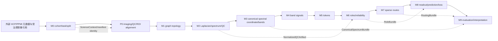

# CanoSPAR 模块协议说明书 v1

**文档版本：** `1.0.0`<br>
**架构契约版本：** `1.0.0`<br>
**科学契约版本：** `1.1.0`<br>
**Schema 版本：** `1.0.0`<br>
**RuntimeProfile 版本：** `1.0.0`<br>
**NumericsProfile Schema 版本：** `1.0.0`<br>
**状态：** FROZEN FOR IMPLEMENTATION<br>
**适用范围：** P0、M0、M1、M2、M3、M4、M5、M6、M7、M8、M9，以及它们之间的 L0-L4 契约边界。

本文档是后续模块实现的接口依据。已有实现、契约占位和未实现模块都必须遵守本文档；“CONTRACT_ONLY”只能表示接口已冻结，不能表示算法已经实现或科学结果已经验证。

## 1. 不可违反的规则

1. 代码中的公共模块入口位于 `src/canospar/api/`；数据读取和元数据构建位于 `src/canospar/data/`。
2. 任何跨模块对象必须使用本文档列出的现有类，或使用本文档明确列出的标准数据类型。不得新增一个没有来源和消费者的 `*Artifact` 类。
3. 每个模块的输入必须来自：上游模块产出的类、明确的科学配置类、`ScienceContext`、`RuntimeProfile`/执行对象，或仓库外受治理的真实数据引用。
4. 每个模块的输出必须被下游模块消费，或成为最终实验结果、验证结果、执行收据的一部分。没有消费者的中间产物不得加入接口。
5. 输入和输出对象均为不可变 dataclass、不可变 tuple、只读 mapping 或复制后的 `torch.Tensor`。不得通过模块边界修改上游对象。
6. 下游模块不得重新计算上游 source-of-truth。需要修改上游语义时，必须使对应上游 artifact 失效并重新生成。
7. M4-M9 在当前基线中仍为 `CONTRACT_ONLY`。它们可以拥有函数、类型和验证器，但不得返回伪造的科学结果。
8. `science_key` 不得包含 CPU/GPU 数量、主机名、服务器类别、Bita、SSH、WebTerminal、调度器并发等运行参数；数值语义变化必须通过 `NumericsProfile` 进入 `reproduction_key`。
9. 真实 HCP/PPMI 原始数据、影像体数据、受限数据、凭据和个人绝对路径不进入 Git。Git 中只保存配置、schema、哈希、聚合报告、合成 fixture 和文档。

## 2. 版本与实现状态

版本命名空间必须保持独立：

| 名称 | 当前值 | 作用 |
| --- | --- | --- |
| `architecture_contract_version` | `1.0.0` | 五层架构和模块边界 |
| `science_contract_version` | `1.1.0` | cohort、任务、拆分、泄漏和数据治理 |
| `module_protocol_spec_version` | `1.0.0` | 本文档冻结的模块输入、输出和函数 |
| `schema_version` | `1.0.0` | artifact 元数据 schema |
| `runtime_profile_version` | `1.0.0` | 执行位置和资源配置 |
| `numerics_profile_schema_version` | `1.0.0` | 数值语义和可复现性身份 |

允许的 `ImplementationStatus` 来自 `src/canospar/contracts/governance.py`：

| 状态 | 含义 |
| --- | --- |
| `EXISTING` | 既有代码或既有结果已经存在，但仍需通过本协议适配 |
| `PARTIAL` | 部分实现存在，跨模块契约或科学实现尚未完整 |
| `CONTRACT_ONLY` | 只有接口、类型和失败闭合行为，不能声称已实现 |
| `IMPLEMENTED` | 按本文档完成实现并通过模块测试 |
| `VERIFIED` | 在 `IMPLEMENTED` 基础上完成规定的科学验证和复现验证 |

## 3. 模块总图与数据闭合



严格的 source-of-truth 所有权如下：

| 模块 | 唯一 source-of-truth |
| --- | --- |
| M0 | cohort、task、split、leakage boundary、manifest |
| P0 | imaging 输入、ROI 对齐、影像 QC |
| M1 | graph topology、节点顺序、关系和边权 |
| M2 | Laplacian、spectrum、图统计、normalized QC |
| M3 | canonical spectral mass coordinate、band boundaries |
| M4 | band-filtered node signals |
| M5 | token assignment、token 表示和 token 元数据 |
| M6 | shared/private/noisy 角色概率和 reliability |
| M7 | route candidate、route score、最终 route |
| M8 | sample embedding、prediction、loss |
| M9 | evaluation、statistical test、mechanism 和 stability report |

## 4. 类型闭合规则

本文档中的以下名称是**类型别名**，不是新的运行时 class，也不是新的 artifact：

```python
from collections.abc import Mapping, Sequence
from pathlib import Path
import torch

JsonScalar = str | int | float | bool | None
JsonValue = JsonScalar | Sequence[JsonScalar] | Mapping[str, JsonScalar]
JsonObject = Mapping[str, JsonValue]
Tensor = torch.Tensor
QCVector = Mapping[str, float]
AvailabilityMask = Mapping[str, bool]
NodeFeatureMatrix = torch.Tensor       # [num_nodes, feature_dim]
EdgeIndex = torch.Tensor               # [2, num_edges], dtype=torch.long
EdgeWeight = torch.Tensor              # [num_edges], floating dtype
FittedQCState = Mapping[str, tuple[float, float]]
TokenPair = tuple["TokenKey", torch.Tensor]
RouteEdge = tuple["TokenKey", "TokenKey"]
ScoredRouteEdge = tuple["TokenKey", "TokenKey", float]
```

`JsonObject` 的嵌套值必须是 JSON 可序列化的标准值；如果后续实现需要更复杂的张量或数组，必须使用已有 artifact 类中的 `torch.Tensor` 字段，不能把任意 Python 对象塞进模块接口。

当前源码中部分字段和函数仍写作 `object`。这些是骨架占位，不是最终协议类型。实现 M2-M9 时，必须将源码注解、运行时校验和测试收敛到本节以及后文的具体类型；在收敛之前，模块保持 `CONTRACT_ONLY`。

## 5. 真实数据边界与 M0 输入

### 5.1 HCP 主协议

HCP 主实验使用 HCP-Young Adult 2025 Open Access imaging 的元数据和官方 unrelated-subject list。HCP Restricted Access 未获批准，`Family_ID` 不作为主协议输入。正式 cohort 只能由以下交集冻结：官方 unrelated 名单、模态可用性、target 完整性、QC 结果。

`configs/data/hcp.yaml` 当前冻结的逻辑输入为：

| 逻辑名 | 真实数据格式/位置 | 用途 |
| --- | --- | --- |
| `data_dictionary` | 外部 CSV | 列含义和 target 字典 |
| `unrelated_list` | 外部 CSV | 官方 unrelated whitelist |
| `subject_export` | 外部 CSV | subject、模态完成度、QC 和 target |
| `appendix_2025` | 外部 PDF | release/采集说明 |
| `access_record` | 外部 Markdown/JSON | access/download 记录 |
| `download_record` | 外部 Markdown/JSON | 下载记录 |
| `download_manifest` | 外部 JSON array | 文件名、sha256 和历史记录 |

HCP 当前 task 配置为 regression，primary target 为 `CogFluidComp_Unadj`，secondary targets 为 `CogTotalComp_Unadj` 和 `PMAT24_A_CR`，primary metric 为 MAE。完整 Open Access cohort 只能用于 pipeline 调试，不能直接随机拆分后作为主结果。

### 5.2 PPMI 协议

PPMI 以 `subject_id` 为拆分单位，同一 subject 的所有 visit 必须进入同一 partition。PPMI HCP-specific provenance 字段使用显式 `not_applicable`，不能用缺失值代替。

`configs/data/ppmi.yaml` 当前冻结的逻辑输入为：

| 逻辑名 | 真实数据格式 | 用途 |
| --- | --- | --- |
| `data_dictionary` | 外部 CSV | 临床字段字典 |
| `code_list` | 外部 CSV | 编码值解释 |
| `participant_status` | 外部 CSV | cohort/enrollment |
| `demographics` | 外部 CSV | 人口学与 visit |
| `mds_updrs_part_i_patient` | 外部 CSV | 临床 target 候选 |
| `mds_updrs_part_i_clinician` | 外部 CSV | 临床 target 候选 |
| `mds_updrs_part_ii_patient` | 外部 CSV | 临床 target 候选 |
| `mds_updrs_part_iii_motor` | 外部 CSV | primary target 候选 |
| `mri_completion` / `archived_mri` | 外部 CSV | MRI completion/current/archive |
| `xing_mri_acquisition` | 外部 CSV | acquisition 质量和可用性 |
| `t1_inventory` / `rsfmri_inventory` / `dti_inventory` | 外部 CSV | source inventory |

PPMI target 由 `configs/data/ppmi_targets.yaml` 和 `evaluate_task_gate` 决定。当前审计保留 candidate A（MDS-UPDRS Part III follow-up minus baseline）和 candidate B 作为分支；任何正式实验必须使用 manifest 中冻结的 task selection，不能在 M8/M9 根据结果反向改 target。

### 5.3 影像和 Week 5-7 边界

真实 DICOM、NIfTI、BIDS、fMRIPrep/QSIPrep/FreeSurfer/MRIQC 目录以及服务器运行状态都位于仓库外。P0 只接收经过 manifest、路径治理、哈希和 QC 约束的引用；`ImagingInputBundle.raw_or_derivative_refs` 保存逻辑引用或受治理路径标识，不把真实影像复制进 Git。

Week 5-7 的 archive、extraction、DICOM/BIDS、atlas、QC 是 P0 和 L3 evidence；MRIQC v2 scheduler、monitor、handoff、Bita、SSH、WebTerminal 是 L3/L4 runtime evidence，不是 M2-M9 的科学实现。

## 6. 共享基础类与字段协议

### 6.1 M0 只读 artifact 引用类

这些类定义在 `src/canospar/api/m0.py`，只保存外部结果的引用和内容哈希，不复制真实数据：

| 类 | 字段 | 生产者 | 消费者 |
| --- | --- | --- | --- |
| `DatasetManifestArtifact` | `artifact_ref: str`, `content_hash: str` | M0 manifest adapter | P0、`ScienceContext` |
| `SplitRegistryArtifact` | `artifact_ref: str`, `content_hash: str` | M0 split adapter | P0-M9 的 split/lineage 校验 |
| `TaskDefinitionArtifact` | `artifact_ref: str`, `content_hash: str` | M0 task adapter | P0-M9 的 task/target 校验 |

`artifact_ref` 必须是仓库外真实输入的可追溯引用、Git 中的配置相对路径或受治理 artifact URI；`content_hash` 必须是对应内容的 SHA-256。当前源码只实现了 `load_dataset_manifest`，split/task loader 是 M0 必须补齐的未实现函数，见第 7 节。

### 6.2 既有真实数据类

#### `GraphData`

定义在 `src/canospar/data/contracts.py`，代表一张单模态、单关系图：

| 字段 | 类型和约束 |
| --- | --- |
| `x` | `torch.Tensor`, shape `[num_nodes, num_features]`，浮点且有限 |
| `edge_index` | `torch.Tensor`, shape `[2, num_edges]`，`torch.long`，索引在节点范围内 |
| `edge_weight` | `torch.Tensor`, shape `[num_edges]`，浮点且有限 |
| `num_nodes` | 正整数，等于 `x.size(0)` |
| `modality` | 非空字符串；当前允许 `smri`、`dmri`、`fmri` |
| `relation` | 非空关系名，如 `atlas_adjacency`、`positive_fc`、`fa_weighted` |
| `graph_qc` | 非空 JSON mapping |
| `construction_hash` | 构图规则、配置和输入的哈希 |

冻结方法：`GraphData.validate() -> None`、`GraphData.to_pyg_data() -> torch_geometric.data.Data`。`to_pyg_data` 只能在验证后复制为 PyG `Data`，不能反向替代 `GraphData`。

#### `BrainMultiGraphSample`

定义在 `src/canospar/data/contracts.py`，代表一个 subject visit：

| 字段 | 类型和约束 |
| --- | --- |
| `subject_id`, `visit_id`, `group_id`, `site_id` | 非空字符串 |
| `graphs` | `Mapping[str, Mapping[str, GraphData]]`，外层 modality 为 `smri`/`dmri`/`fmri` |
| `modality_available` | `Mapping[str, bool]`，必须恰好包含三个 modality |
| `qc_vector` | `Mapping[str, float]`，值有限 |
| `target` | 有限 `float | int` |
| `covariates` | `Mapping[str, float | str]` |
| `cohort_metadata` | `Mapping[str, str]`，必须包含 `cohort_source`、`unrelated_list_version`、`kinship_control_method` |

冻结方法：`BrainMultiGraphSample.validate() -> None`。`group_id` 是拆分单位；HCP 主协议中等于 `subject_id`，PPMI 中同样按 `subject_id` 绑定所有 visit。

### 6.3 通用 artifact 类

#### `ArtifactMeta`

定义在 `src/canospar/contracts/base.py`，所有正式科学 artifact 必须携带：

```text
schema_version: str
artifact_type: str
artifact_id: str
producer_module: str
module_contract_version: str
science_contract_version: str
input_artifact_ids: tuple[str, ...]
input_content_hashes: tuple[str, ...]
science_config_hash: str
dataset_manifest_hash: str | None
split_id: str | None
random_seed: int | None
content_sha256: str
implementation_hash: str
numerics_profile_hash: str
created_at_utc: str
```

`input_artifact_ids` 与 `input_content_hashes` 长度必须相等。除 `dataset_manifest_hash`、`split_id`、`random_seed` 外所有字段必须为非空字符串。

#### `ScienceContext`

```text
science_contract_version: str
science_config_hash: str
dataset_manifest_hash: str | None
split_id: str | None
random_seed: int | None
```

它携带科学身份，不携带运行资源。每个 M1-M9 科学函数都必须接收 `ScienceContext`，除 M2/M3 的纯内部数学 helper 外不得省略。

#### 稳定键

| 类 | 字段 | 来源 |
| --- | --- | --- |
| `GraphKey` | `subject`, `visit`, `modality`, `relation` | `BrainMultiGraphSample` + `GraphData` |
| `BandKey` | `graph_key: GraphKey`, `band_id: str` | M3 `BandDefinition` |
| `TokenKey` | `band_key: BandKey`, `token_id: str` | M5 token assignment |

冻结函数：

```python
build_science_key(
    context: ScienceContext,
    input_content_hashes: Sequence[str],
    module_contract_version: str,
    *,
    runtime_profile_id: str | None = None,
) -> str

build_reproduction_key(
    science_key: str,
    implementation_hash: str,
    numerics_profile_hash: str,
) -> str
```

`runtime_profile_id` 在 `build_science_key` 中必须被忽略；它只能写入 `CompletionReceipt`。

### 6.4 影像 artifact 类

#### `ImagingInputBundle`

定义在 `src/canospar/contracts/imaging.py`，由 M0 的 manifest/real-data adapter 产生，供 P0 消费：

```text
subject_id: str
visit_id: str
dataset: str
raw_or_derivative_refs: Mapping[str, str]
modality_available: Mapping[str, bool]
acquisition_metadata: Mapping[str, Any]
source_hashes: Mapping[str, str]
```

`raw_or_derivative_refs` 的 key 必须指向真实来源或 derivative 逻辑名；`source_hashes` 必须覆盖进入 P0 的来源。`acquisition_metadata` 只保存可治理的 JSON 元数据，不保存影像体素。

#### `ROIAlignedSample`

定义在 `src/canospar/contracts/imaging.py`，由 P0 产生，供 M1 消费：

```text
meta: ArtifactMeta
subject_id: str
visit_id: str
atlas_id: str
atlas_hash: str
roi_table_hash: str
node_order_hash: str
modality_payloads: Mapping[str, Mapping[str, torch.Tensor]]
modality_available: Mapping[str, bool]
qc_vector: Mapping[str, float]
qc_status: str
source_artifact_ids: tuple[str, ...]
```

`modality_payloads` 是对现有源码 `Mapping[str, Any]` 的协议收敛：外层 key 为 `smri`、`dmri`、`fmri`，内层 value 是已对齐的 ROI 级 tensor 命名表。M1 不得从原始影像重新选择 ROI 或改变 `node_order_hash`。

### 6.5 M2-M9 artifact 类

下表列出的类都已经存在于 `src/canospar/contracts/`。表中的 tensor、mapping 和 tuple 是字段语义的冻结类型；它们不是新增 class。

| 类 | 字段语义 | 生产者 | 下游/最终用途 |
| --- | --- | --- | --- |
| `LaplacianArtifact` | `meta: ArtifactMeta`; `graph_key: GraphKey`; `payload: torch.Tensor`，方阵 | M2 | `compute_spectrum`、M4 |
| `SpectrumArtifact` | `meta`; `graph_key`; `eigenvalues: torch.Tensor`，升序有限向量 | M2 | M3、M2 statistics |
| `SpectralStatistics` | `meta`; `graph_key`; `values: Mapping[str, float]` | M2 | M6、M9、最终解释 |
| `NormalizedQCArtifact` | `meta`; `values: Mapping[str, float]` | M2 | M6、M9 |
| `SpectralBundle` | `meta`; `laplacians: tuple[LaplacianArtifact, ...]`; `spectra: tuple[SpectrumArtifact, ...]`; `statistics: tuple[SpectralStatistics, ...]`; `normalized_qc: NormalizedQCArtifact | None` | M2 | M3、M4、M9 |
| `CanonicalSpectrumArtifact` | `meta`; `graph_key: GraphKey`; `spectrum_artifact_id: str`; `u_coordinate: torch.Tensor`; `lambda_coordinate: torch.Tensor` | M3 | `CanonicalSpectrumBundle` |
| `BandDefinition` | `band_id`; `lower_mass`, `upper_mass` in `[0,1]`; optional lambda bounds | M3 | M4、M9 |
| `CanonicalSpectrumBundle` | `meta`; `spectra: tuple[CanonicalSpectrumArtifact, ...]`; `bands: tuple[BandDefinition, ...]` | M3 | M4、M9 |
| `BandSignalBundle` | `meta`; `signals: tuple[tuple[BandKey, torch.Tensor], ...]`，tensor 为 `[num_nodes, feature_dim]` | M4 | M5 |
| `TokenBundle` | `meta`; `tokens: tuple[TokenPair, ...]`; `assignment: torch.Tensor`; `token_ids`; JSON `token_metadata`; `token_mass: torch.Tensor`; `assignment_entropy: torch.Tensor` | M5 | M6、M7、M8 |
| `RoleBundle` | `meta`; `token_ids`; `shared_probability`、`private_probability`、`noisy_probability`、`reliability: torch.Tensor` | M6 | M7、M8、M9 |
| `RouteCandidateGraph` | `meta`; `edges: tuple[RouteEdge, ...]` | M7 | `score_routes`、`RoutingBundle` |
| `RouteScoreGraph` | `meta`; `scores: tuple[ScoredRouteEdge, ...]` | M7 | `route_tokens`、`RoutingBundle` |
| `RouteGraph` | `meta`; `edges: tuple[ScoredRouteEdge, ...]` | M7 | `RoutingBundle`、M8、M9 |
| `RoutedTokenBundle` | `meta`; `values: tuple[TokenPair, ...]` | M7 | M8 |
| `RoutingBundle` | `meta`; optional candidates/scores/routes/routed_tokens | M7 | M8、M9 |
| `SampleEmbedding` | `meta`; `shared_embedding`、`private_embedding`、`global_embedding: torch.Tensor | None` | M8 | `PredictionBundle`、M9 |
| `PredictionBundle` | `meta`; `prediction: torch.Tensor`; optional `embedding: SampleEmbedding` | M8 | `LossBundle`、M9 |
| `LossBundle` | `meta`; `values: Mapping[str, float]` | M8 | 最终训练记录、M9/实验报告 |
| `ExperimentRegistry` | `artifact_ref: str`; `registry_hash: str` | M0/实验注册 | M9 |
| `MetricReport` | `meta`; `metrics: Mapping[str, float]` | M9 | `EvaluationBundle`/最终结果 |
| `MechanismReport` | `meta`; `values: JsonObject` | M9 | `EvaluationBundle`/最终结果 |
| `RobustnessReport` | `meta`; `values: JsonObject` | M9 | `EvaluationBundle`/最终结果 |
| `StabilityReport` | `meta`; `values: JsonObject` | M9 | `EvaluationBundle`/最终结果 |
| `StatisticalTestReport` | `meta`; `values: JsonObject` | M9 | `EvaluationBundle`/最终结果 |
| `EvaluationBundle` | `meta`; `reports: tuple[MetricReport | MechanismReport | RobustnessReport | StabilityReport | StatisticalTestReport, ...]` | M9 | 最终 evaluation artifact |

### 6.6 执行和验证类

这些对象属于 L3/L4，不是科学算法输出：

| 类/函数 | 作用 |
| --- | --- |
| `CanonicalStatus` | `PASS`、`READY`、`BLOCKED`、`FAIL`、`INVALIDATED` |
| `CompletionReceipt` | module/version、输入输出 ID/hash、science/reproduction key、runtime profile ID、validator status、时间和 issue codes |
| `ModuleRunResult[_Artifact]` | `canonical_status`、`native_status`、可选 artifact、receipt、`tuple[ValidationIssue, ...]` |
| `RuntimeProfile` | CPU、RAM、GPU、worker、container、scheduler、transport、server 等运行信息 |
| `NumericsProfile` | dtype、precision、deterministic algorithm、线代/eigensolver backend、tolerance、数值库版本 |
| `ValidationIssue` | `code`、`severity`、`field`、`message` |
| `ValidationReport` | status、checked invariants、issues |
| `validate_artifact_meta` | schema/hash/identity validation |
| `cache_is_eligible` | fail-closed cache predicate |
| `compute_invalidated_modules` | 固定 DAG 的失效传播 |

### 6.7 科学配置类

以下类均为现有 frozen dataclass；它们是模块配置输入，不是模块输出，也不能包含真实数据或运行资源：

| 类 | 字段 | 消费模块 |
| --- | --- | --- |
| `GraphConstructionSpec` | `backend: str`; `parameters: Mapping[str, JsonValue]` | M1 |
| `M2Spec` | `backend: str`; `parameters: Mapping[str, JsonValue]` | M2 |
| `CanonicalCoordinateSpec` | `method: str`; `parameters: Mapping[str, JsonValue]` | M3 |
| `BandSpec` | `band_count: int > 0`; `tie_policy: str` | M3 |
| `FilterSpec` | `backend: str`; `parameters: Mapping[str, JsonValue]` | M4 |
| `TokenizationSpec` | `backend: str`; `token_count: int > 0`; `parameters: Mapping[str, JsonValue]` | M5 |
| `RoleSpec` | `backend: str`; `parameters: Mapping[str, JsonValue]` | M6 |
| `RoutingSpec` | `backend: str`; `top_k: int > 0`; `parameters: Mapping[str, JsonValue]` | M7 |
| `ReadoutSpec` | `backend: str`; `parameters: Mapping[str, JsonValue]` | M8 |
| `EvaluationSpec` | `backend: str`; `parameters: Mapping[str, JsonValue]` | M9 |

源码当前使用 `Mapping[str, Any]` 以保留骨架兼容性；正式实现不得把任意对象、模型实例或运行时句柄放入这些 mapping。backend 的具体实现通过 `backend` 字符串和实现哈希进入 provenance，不能改变模块公共返回类型。

冻结函数：

```python
validate_artifact_meta(
    meta: ArtifactMeta,
    *,
    expected_schema_version: str | None = None,
    expected_content_sha256: str | None = None,
) -> ValidationReport

cache_is_eligible(
    *,
    expected_science_key: str,
    expected_reproduction_key: str,
    artifact_hash: str,
    receipt: CompletionReceipt,
    validator_status: str,
) -> bool

compute_invalidated_modules(changed_module: str) -> tuple[str, ...]
build_numerics_profile_hash(profile: NumericsProfile) -> str
```

缓存必须同时满足 expected science key、expected reproduction key、输出 hash、receipt status `PASS/READY` 和 validator status `PASS`。任何一个条件缺失或不匹配都返回 `False`。

## 7. M0：数据协议、任务与拆分

**当前状态：** `EXISTING + adapter`。<br>
**source-of-truth：** `cohort_task_split`。<br>
**不负责：** 影像处理、图构建、模型训练。

### 7.1 输入

1. HCP/PPMI 外部 CSV、JSON、YAML、Markdown、PDF 元数据，具体见第 5 节。
2. `configs/data/hcp.yaml`、`configs/data/ppmi.yaml`、column map、manifest schema、PPMI target config。
3. 真实数据访问权限状态和 source manifest；不得直接读取未声明的目录。

### 7.2 输出

| 输出 | 类 | 必须被谁消费 |
| --- | --- | --- |
| manifest 引用与 hash | `DatasetManifestArtifact` | P0、`ScienceContext` |
| split 引用与 hash | `SplitRegistryArtifact` | P0-M9 的 leakage/split 校验 |
| task/target 引用与 hash | `TaskDefinitionArtifact` | P0-M9 的 target/任务校验 |
| manifest 行 | `HCPManifestResult.manifest` 或 `PPMIManifestResult.manifest` 的 `tuple[dict[str, JsonValue], ...]` | 构造上述引用 artifact、P0 输入 |
| 审计结果 | `ManifestAuditResult`、`ManifestValidationResult`、`TaskGateDecision` | M0 最终 gate 和 reports |

manifest row 必须使用 `configs/data/manifest_schema.yaml` 的字段。字段分组如下，类型为 schema 中的真实类型：

| 分组 | 字段 |
| --- | --- |
| identity | `dataset: str`、`source_release: str`、`subject_id: str`、`visit_id: str`、`group_id: str`、`family_id: None`、`site_id: str`、`site_available: bool`、`site_source: str` |
| scanner | `scanner_vendor: str | None`、`scanner_model: str | None`、`field_strength: float | None`、`normalized_protocol: str | None`、`scanner_batch_id: str | None` |
| phenotype/task | `age: float | None`、`sex: str | None`、`diagnosis: str | None`、`diagnosis_source: str | None`、`target: float | None`、`target_name: str | None`、`target_date: ISO date | None`、`imaging_date: ISO date | None`、`imaging_clinical_interval_days: float | None` |
| modality | 对 `t1`、`fmri`、`dwi` 各保存 `*_available: bool`、`*_downloaded: bool`、`*_preprocessed: bool`、`*_qc_pass: bool | None`、`*_path: str` |
| status | `raw_qc_status: str | None`、`exclusion_reason`、`availability_basis`、`availability_snapshot_date: ISO date`、`cohort_status`、`row_status` |
| provenance | `source_manifest_hash: SHA256`、`contract_version: "1.1.0"`、`cohort_source`、`unrelated_list_version`、`kinship_control_method` |

### 7.3 已有和必须冻结的函数

已有数据层函数：

```python
build_hcp_manifest(config_path: Path, metadata_root: Path) -> HCPManifestResult
build_ppmi_manifest(config_path: Path, metadata_root: Path) -> PPMIManifestResult
validate_manifest_file(
    manifest_path: Path,
    schema_path: Path | None = None,
    *,
    repository_root: Path | None = None,
) -> ManifestValidationResult
audit_manifest_file(manifest_path: Path, dataset: str) -> ManifestAuditResult
evaluate_task_gate(
    independent_subject_count: int,
    *,
    target_confirmed: bool = False,
    part_iii_state_policy_confirmed: bool = False,
    stress_test_threshold: int = 120,
    ready_threshold: int = 180,
) -> TaskGateDecision
```

M0 公共 API：

```python
load_dataset_manifest(artifact_ref: str) -> DatasetManifestArtifact
```

`load_dataset_manifest` 当前为只读 `CONTRACT_ONLY`。为使注册表中的三个 M0 输出真正闭合，后续必须补齐以下函数；它们返回已有类，不得新增引用类：

```python
load_split_registry(artifact_ref: str) -> SplitRegistryArtifact
load_task_definition(artifact_ref: str) -> TaskDefinitionArtifact

build_imaging_input_bundle(
    manifest: DatasetManifestArtifact,
    split: SplitRegistryArtifact,
    task: TaskDefinitionArtifact,
    *,
    subject_id: str,
    visit_id: str,
    dataset: str,
    raw_or_derivative_refs: Mapping[str, str],
    modality_available: AvailabilityMask,
    acquisition_metadata: JsonObject,
    source_hashes: Mapping[str, str],
) -> ImagingInputBundle
```

### 7.4 不可违反的科学约束

- 拆分先于任何 data-dependent preprocessing、feature selection、graph construction 和 statistical estimation。
- HCP 主实验以 subject 为 group；PPMI 的所有 visit 以 subject 为 group。
- 测试集永久封存；测试标签不能参与 QC、阈值、特征、harmonization 或模型选择。
- HCP 不能把完整 Open Access cohort 直接随机拆分作为主结果，不能混用 HCP-YA 2025 与 2017 S1200 processed imaging。
- `family_id` 主协议固定为 `None`；PPMI 的 HCP-only 字段固定为 `not_applicable`。

## 8. P0：影像输入、QC 与 ROI 对齐

**当前状态：** `PARTIAL`。<br>
**source-of-truth：** `roi_alignment_qc`。<br>
**输入：** `ImagingInputBundle`、`ScienceContext`。<br>
**输出：** `ROIAlignedSample`。

### 8.1 冻结函数

```python
class P0Backend(Protocol):
    def prepare_imaging_sample(
        self,
        bundle: ImagingInputBundle,
        context: ScienceContext,
    ) -> ROIAlignedSample: ...

prepare_imaging_sample(
    bundle: ImagingInputBundle,
    context: ScienceContext,
) -> ROIAlignedSample
```

当前入口是 `CONTRACT_ONLY`。P0 的实现必须：

1. 根据 manifest 和受治理引用读取实际 derivative；不自行发现未声明的真实数据。
2. 验证 subject、visit、dataset、模态 availability 和 source hash。
3. 执行 atlas/ROI 对齐并生成 `atlas_hash`、`roi_table_hash`、`node_order_hash`。
4. 生成 `qc_vector` 和 `qc_status`；QC 规则只能来自 M0 冻结的 task/config 或 train-only 拟合参数。
5. 输出 `ROIAlignedSample.source_artifact_ids`，至少关联 M0 manifest/split/task 的 artifact ID。

P0 不得输出 `BrainMultiGraphSample`，因为 graph topology 的 source-of-truth 属于 M1。

## 9. M1：多模态多关系图构建

**当前状态：** `PARTIAL / contract boundary`。<br>
**source-of-truth：** `graph_topology`。<br>
**输入：** `ROIAlignedSample`、`GraphConstructionSpec`、`ScienceContext`。<br>
**输出：** `MultiGraphArtifact`。

### 9.1 冻结函数

```python
@dataclass(frozen=True)
class GraphConstructionSpec:
    backend: str
    parameters: Mapping[str, JsonScalar | Sequence[JsonScalar]]

class M1Backend(Protocol):
    def build_multigraph_sample(
        self,
        sample: ROIAlignedSample,
        spec: GraphConstructionSpec,
        context: ScienceContext,
    ) -> MultiGraphArtifact: ...

build_multigraph_sample(
    sample: ROIAlignedSample,
    spec: GraphConstructionSpec,
    context: ScienceContext,
) -> MultiGraphArtifact

validate_graph(graph: GraphData) -> ValidationReport
```

`GraphConstructionSpec` 当前已经存在，`build_multigraph_sample` 和 `validate_graph` 当前为 `CONTRACT_ONLY`。每个输出 `GraphData` 必须验证：节点数/顺序、edge index、edge weight、modality、relation、构图 hash、graph QC。构图不得使用 target 或测试集统计。

MRI 的允许关系来源：

- `smri`：ROI 形态学特征、atlas adjacency、形态相似或解剖距离稀疏关系；
- `dmri`：FA/MD/AD/RD、streamline 或 SIFT2 权重等真实 derivative；
- `fmri`：Pearson/partial correlation、正/负 FC 或动态摘要；正负关系必须分开记录。

M1 只输出 `MultiGraphArtifact(meta, sample, atlas_id, atlas_hash, roi_table_hash, node_order_hash)`；下游不得用 P0 payload 绕过它重新构图。

## 10. M2：Laplacian、谱和 QC

**当前状态：** `CONTRACT_ONLY`。<br>
**source-of-truth：** `laplacian_spectrum`。<br>
**输入：** `MultiGraphArtifact`、`M2Spec`、`ScienceContext`。<br>
**输出：** `SpectralBundle`，其中可选包含 `NormalizedQCArtifact`。

### 10.1 冻结函数

```python
class M2Backend(Protocol):
    def run_m2(
        self,
        multigraph: MultiGraphArtifact,
        spec: M2Spec,
        context: ScienceContext,
    ) -> SpectralBundle: ...

build_normalized_laplacian(
    graph: GraphData,
    spec: M2Spec,
) -> LaplacianArtifact

compute_spectrum(
    laplacian: LaplacianArtifact,
    spec: M2Spec,
) -> SpectrumArtifact

compute_spectral_statistics(
    laplacian: LaplacianArtifact,
    spectrum: SpectrumArtifact,
    node_features: NodeFeatureMatrix,
) -> SpectralStatistics

fit_qc_transform(
    train_qc: Sequence[QCVector],
    spec: M2Spec,
) -> FittedQCState

transform_qc(
    qc: QCVector,
    state: FittedQCState,
) -> NormalizedQCArtifact

run_m2(
    multigraph: MultiGraphArtifact,
    spec: M2Spec,
    context: ScienceContext,
) -> SpectralBundle
```

源码中的 `object` 参数/返回值必须按本节收敛为 `GraphData`、`torch.Tensor`、`QCVector` 或 `FittedQCState`。`FittedQCState` 是标准 mapping，不是新增 class。

数学和数据约束：

- 默认归一化 Laplacian 为 `L = I - D^{-1/2} A D^{-1/2}`；有符号关系、非对称图、孤立节点、自环、权重归一化必须在 `M2Spec.parameters` 中明确。
- `LaplacianArtifact.graph_key` 和 `SpectrumArtifact.graph_key` 必须由 `GraphKey` 产生。
- `SpectrumArtifact.eigenvalues` 必须是升序、有限、与节点数对应的 `torch.Tensor`。
- `fit_qc_transform` 只能使用训练 partition 的 `BrainMultiGraphSample.qc_vector` 或 M2 输出统计；验证/测试只能调用 `transform_qc`。
- `NormalizedQCArtifact` 是 M6 的 QC 输入，不得让 M6 重新拟合归一化。

## 11. M3：Canonical Spectral Mass Coordinate 与频带

**当前状态：** `CONTRACT_ONLY`。<br>
**source-of-truth：** `canonical_coordinate_bands`。<br>
**输入：** `SpectralBundle`、`CanonicalCoordinateSpec`、`BandSpec`、`ScienceContext`。<br>
**输出：** `CanonicalSpectrumBundle`。

### 11.1 冻结函数

```python
class M3Backend(Protocol):
    def run_m3(
        self,
        spectral_bundle: SpectralBundle,
        coordinate_spec: CanonicalCoordinateSpec,
        band_spec: BandSpec,
        context: ScienceContext,
    ) -> CanonicalSpectrumBundle: ...

canonical_mass_coordinate(
    spectrum: SpectrumArtifact,
    coordinate_spec: CanonicalCoordinateSpec,
) -> CanonicalSpectrumArtifact

build_canonical_bands(
    spectral_bundle: SpectralBundle,
    coordinate_spec: CanonicalCoordinateSpec,
    band_spec: BandSpec,
) -> tuple[BandDefinition, ...]

validate_canonical_bands(
    bands: Sequence[BandDefinition],
) -> ValidationReport

run_m3(
    spectral_bundle: SpectralBundle,
    coordinate_spec: CanonicalCoordinateSpec,
    band_spec: BandSpec,
    context: ScienceContext,
) -> CanonicalSpectrumBundle
```

现有源码把 `build_canonical_bands` 的返回注解写成单个 `BandDefinition`，把 `canonical_mass_coordinate` 的输入写成 `object`，把验证器返回写成 `object`。这是已识别的骨架注解缺口；实现前必须按本节修正为 tuple、`SpectrumArtifact` 和 `ValidationReport`，否则 M3 不能标记为 `IMPLEMENTED`。

数学约束：对每个 `SpectrumArtifact.eigenvalues = (lambda_1, ..., lambda_n)`，按升序计算经验 CDF `u_i = F_L(lambda_i)`，并由 `BandSpec.band_count` 生成 `band_count` 个不重叠、覆盖 `[0,1]` 的 `BandDefinition`。M3 不得从 `GraphData` 重新计算 spectrum。

## 12. M4：规范频带图滤波

**当前状态：** `CONTRACT_ONLY`。<br>
**source-of-truth：** `band_signal`。<br>
**输入：** `MultiGraphArtifact`、`SpectralBundle`、`CanonicalSpectrumBundle`、`FilterSpec`、`ScienceContext`。<br>
**输出：** `BandSignalBundle`。

### 12.1 冻结函数

```python
filter_exact(
    multigraph: MultiGraphArtifact,
    spectral_bundle: SpectralBundle,
    canonical_bundle: CanonicalSpectrumBundle,
    spec: FilterSpec,
    context: ScienceContext,
) -> BandSignalBundle

filter_chebyshev(
    multigraph: MultiGraphArtifact,
    spectral_bundle: SpectralBundle,
    canonical_bundle: CanonicalSpectrumBundle,
    spec: FilterSpec,
    context: ScienceContext,
) -> BandSignalBundle

filter_bands(
    multigraph: MultiGraphArtifact,
    spectral_bundle: SpectralBundle,
    canonical_bundle: CanonicalSpectrumBundle,
    spec: FilterSpec,
    context: ScienceContext,
) -> BandSignalBundle
```

`filter_exact` 用于小图基准，`filter_chebyshev` 用于可扩展实现，`filter_bands` 是统一入口。输出每个 `(BandKey, torch.Tensor[num_nodes, feature_dim])`，必须保留 graph key 和 band key。不得在 M4 修改 canonical band boundary 或偷偷使用原始 lambda 区间替代 mass coordinate。

## 13. M5：频带 Token 化

**当前状态：** `CONTRACT_ONLY`。<br>
**source-of-truth：** `tokens`。<br>
**输入：** `BandSignalBundle`、`TokenizationSpec`、`ScienceContext`。<br>
**输出：** `TokenBundle`。

### 13.1 冻结函数

```python
tokenize_bands(
    band_signals: BandSignalBundle,
    spec: TokenizationSpec,
    context: ScienceContext,
) -> TokenBundle

validate_token_bundle(tokens: TokenBundle) -> ValidationReport
```

对每一个 `BandSignalBundle.signals` 项，assignment 必须是 `[num_nodes, token_count]` 的 `torch.Tensor`，token 表示是 `[token_count, feature_dim]`，并且每个 token 都能通过 `BandKey` 和 `TokenKey` 回溯到 graph/band。`token_metadata` 只能保存 JSON 数据，例如 modality、relation、band center/width、graph quality、availability、assignment sparsity 和 uncertainty。

M5 必须验证 token 使用率、assignment 稀疏性、覆盖率、空 token 和 token 间退化；验证失败时输出 `ValidationReport.FAIL`，不能静默删除 token。

## 14. M6：角色判定与 reliability

**当前状态：** `CONTRACT_ONLY`。<br>
**source-of-truth：** `roles_reliability`。<br>
**输入：** `TokenBundle`、`NormalizedQCArtifact`、`AvailabilityMask`、`RoleSpec`、`ScienceContext`。<br>
**输出：** `RoleBundle`。

### 14.1 冻结函数

```python
infer_roles(
    tokens: TokenBundle,
    normalized_qc: NormalizedQCArtifact,
    availability: AvailabilityMask,
    spec: RoleSpec,
    context: ScienceContext,
) -> RoleBundle

validate_role_bundle(roles: RoleBundle) -> ValidationReport
```

对每一个 `TokenKey`，`shared_probability`、`private_probability`、`noisy_probability` 必须是形状一致的 `torch.Tensor`，三者逐 token 之和为 1；`reliability` 与 token 数一致且为有限值。`availability` 必须能由 M0/P0 的 `modality_available` 追溯，不得由 M6 重新判断影像是否存在。

角色语义：shared 可跨图发送/接收，private 保留模态特异性，noisy 在主预测路径中降权并可用于重建。M6 不得执行路由；路由属于 M7。

## 15. M7：角色条件稀疏路由

**当前状态：** `CONTRACT_ONLY`。<br>
**source-of-truth：** `routes`。<br>
**输入：** `TokenBundle`、`RoleBundle`、`RoutingSpec`、`ScienceContext`。<br>
**输出：** `RoutingBundle`。

### 15.1 冻结函数

```python
build_route_candidates(
    tokens: TokenBundle,
    roles: RoleBundle,
    spec: RoutingSpec,
    context: ScienceContext,
) -> RouteCandidateGraph

score_routes(
    candidates: RouteCandidateGraph,
    tokens: TokenBundle,
    roles: RoleBundle,
    spec: RoutingSpec,
    context: ScienceContext,
) -> RouteScoreGraph

route_tokens(
    tokens: TokenBundle,
    roles: RoleBundle,
    spec: RoutingSpec,
    context: ScienceContext,
) -> RoutingBundle
```

`RouteCandidateGraph.edges` 只允许使用 `TokenKey` 对；默认禁止同一 graph 内部通信，是否允许同模态跨 relation 或跨模态同 relation 必须由 `RoutingSpec.parameters` 明确。`RouteScoreGraph.scores` 必须保存语义相似度、频带惩罚、质量惩罚和 relation compatibility 形成的最终 score，`RouteGraph` 只保留 top-k 合法边。

M7 不得改变 `RoleBundle` 中的角色概率，不得把 noisy/private token 伪装成 shared，不得产生 dense route 替代 top-k 稀疏路由。

## 16. M8：读出、预测与 loss

**当前状态：** `CONTRACT_ONLY`。<br>
**source-of-truth：** `prediction_objective`。<br>
**输入：** `TokenBundle`、`RoleBundle`、`RoutingBundle`、`ReadoutSpec`、`ScienceContext`。<br>
**输出：** `SampleEmbedding`、`PredictionBundle`、`LossBundle`。

### 16.1 冻结函数

```python
readout_sample(
    tokens: TokenBundle,
    roles: RoleBundle,
    routes: RoutingBundle,
    spec: ReadoutSpec,
    context: ScienceContext,
) -> SampleEmbedding

predict_sample(
    tokens: TokenBundle,
    roles: RoleBundle,
    routes: RoutingBundle,
    spec: ReadoutSpec,
    context: ScienceContext,
) -> PredictionBundle

compute_objective(
    prediction: PredictionBundle,
    context: ScienceContext,
) -> LossBundle
```

`readout_sample` 必须聚合 routed shared token、private token 和必要的 quality/global statistics；`predict_sample` 必须把 prediction 与使用的 `SampleEmbedding` 绑定；`compute_objective` 输出至少包含 `task`、`route`、`decorrelation`、`reconstruction`（若启用）和 `total` 的有限标量 loss mapping。

M8 不得读取测试标签参与训练，不得在 prediction 中重新计算 M2/M3/M6/M7 的结果。分类 prediction 以 logits/probability tensor 表示，回归 prediction 以 shape `[batch, 1]` 或等价 tensor 表示；最终 target 来自 M0 冻结 task。

## 17. M9：evaluation、机制和解释

**当前状态：** `CONTRACT_ONLY`。<br>
**source-of-truth：** `evaluation`。<br>
**输入：** M8 prediction、M7 routes、M6 roles、M2 spectral、M3 canonical、`ExperimentRegistry` 和 `EvaluationSpec`。<br>
**输出：** 若干 report 以及最终 `EvaluationBundle`。

### 17.1 冻结函数

```python
evaluate_predictions(
    prediction: PredictionBundle,
    registry: ExperimentRegistry,
) -> MetricReport

evaluate_spectral_mechanism(
    spectral: SpectralBundle,
    canonical: CanonicalSpectrumBundle,
    spec: EvaluationSpec,
) -> MechanismReport

evaluate_robustness(
    prediction: PredictionBundle,
    spec: EvaluationSpec,
) -> RobustnessReport

evaluate_route_stability(
    routes: RoutingBundle,
    roles: RoleBundle,
    spec: EvaluationSpec,
) -> StabilityReport

run_statistical_tests(
    prediction: PredictionBundle,
    registry: ExperimentRegistry,
    spec: EvaluationSpec,
) -> StatisticalTestReport

evaluate(
    prediction: PredictionBundle,
    routes: RoutingBundle,
    roles: RoleBundle,
    spectral: SpectralBundle,
    canonical: CanonicalSpectrumBundle,
    registry: ExperimentRegistry,
) -> EvaluationBundle
```

M9 是只读模块，不能 retrain、调参或修改任何上游 artifact。必须覆盖：节点置换、滤波近似误差、谱 CDF 误差、拓扑扰动、稀疏复杂度、负迁移、路由稳定性、模态污染和缺失模态鲁棒性。`evaluate` 的配置从 `ExperimentRegistry.artifact_ref` 读取并由 registry hash 绑定；不得在函数内部创建未登记的实验。

## 18. 函数冻结总表

下表是后续代码 review 的最小公共函数集合：

| 模块 | 函数 | 当前状态 |
| --- | --- | --- |
| M0 | `build_hcp_manifest`、`build_ppmi_manifest`、`validate_manifest_file`、`audit_manifest_file`、`evaluate_task_gate` | EXISTING |
| M0 | `load_dataset_manifest` | CONTRACT_ONLY |
| M0 | `load_split_registry`、`load_task_definition`、`build_imaging_input_bundle` | REQUIRED / NOT YET IN SOURCE |
| P0 | `prepare_imaging_sample` | CONTRACT_ONLY |
| M1 | `build_multigraph_sample`、`validate_graph` | CONTRACT_ONLY |
| M2 | `build_normalized_laplacian`、`compute_spectrum`、`compute_spectral_statistics`、`fit_qc_transform`、`transform_qc`、`run_m2` | CONTRACT_ONLY |
| M3 | `canonical_mass_coordinate`、`build_canonical_bands`、`validate_canonical_bands`、`run_m3` | CONTRACT_ONLY；注解需收敛 |
| M4 | `filter_exact`、`filter_chebyshev`、`filter_bands` | CONTRACT_ONLY |
| M5 | `tokenize_bands`、`validate_token_bundle` | CONTRACT_ONLY |
| M6 | `infer_roles`、`validate_role_bundle` | CONTRACT_ONLY |
| M7 | `build_route_candidates`、`score_routes`、`route_tokens` | CONTRACT_ONLY |
| M8 | `readout_sample`、`predict_sample`、`compute_objective` | CONTRACT_ONLY |
| M9 | `evaluate_predictions`、`evaluate_spectral_mechanism`、`evaluate_robustness`、`evaluate_route_stability`、`run_statistical_tests`、`evaluate` | CONTRACT_ONLY |
| L3 | `validate_artifact_meta`、`cache_is_eligible`、`compute_invalidated_modules` | EXISTING |
| L3/L4 | `build_science_key`、`build_reproduction_key`、`build_numerics_profile_hash` | EXISTING |

实现函数的命名、参数顺序、返回 artifact 类型和失败行为不得在没有 ADR、版本变更、migration adapter、兼容测试和 invalidation analysis 的情况下改变。

## 19. 当前骨架的明确收敛项

以下事项不是新的科学模块，而是将现有骨架从“可导入占位”收敛为可实现协议的必要工作：

1. 将 M2 的 `graph: object` 收敛为 `GraphData`，`node_features: object` 收敛为 `torch.Tensor`，QC helper 收敛为 `QCVector/FittedQCState`。
2. 将 M3 的 `spectrum: object` 收敛为 `SpectrumArtifact`，`build_canonical_bands` 改为返回 `tuple[BandDefinition, ...]`，验证器返回 `ValidationReport`。
3. 将 artifact family 中的 `graph_key`、coordinates、signals、tokens、roles、routes、embedding 等 `object` 字段按第 6.5 节的已有类/标准 tensor/tuple 类型校验。
4. M6 将 `normalized_qc` 收敛为已有 `NormalizedQCArtifact`，`availability` 收敛为 `Mapping[str, bool]`。
5. M0 增加 split/task 的只读 loader 和 `ImagingInputBundle` builder，返回的仍是已有类。
6. 为每个 CONTRACT_ONLY 函数补充“输入 artifact schema mismatch、lineage mismatch、未就绪 upstream”时的 fail-closed 测试；不得用空 tensor、随机 tensor 或空 report 假装成功。

在这些收敛项完成前，架构验证可以证明接口存在，但不能把相应模块标为 `IMPLEMENTED` 或 `VERIFIED`。

## 20. 缓存、失效和失败行为

固定失效 DAG：

```text
M0 -> P0 -> M1 -> M2 -> M3 -> M4 -> M5 -> M6 -> M7 -> M8 -> M9
```

改变某模块时，该模块及其所有下游失效。例如：

- M3 变化：失效 M3-M9，保留 M0、P0、M1、M2；
- M0 变化：失效 M0、P0、M1-M9；
- 仅修改 RuntimeProfile：如果 science identity 和 numerics identity 不变，不失效科学 artifact；
- 修改 dtype、eigensolver、solver tolerance 或数值库版本：更新 `numerics_profile_hash` 和 `reproduction_key`，不得直接复用旧 reproduction。

任何 `SchemaVersionMismatch`、`ArtifactHashMismatch`、`DatasetLineageMismatch`、`SplitMismatch`、`LeakageViolation`、`UpstreamArtifactInvalid` 或 `ArtifactNotReady` 都必须 fail closed。错误类型来自 `src/canospar/contracts/errors.py`，不得吞掉后继续下游计算。

## 21. 实现完成的判定

一个模块只有同时满足以下条件才可以从 `CONTRACT_ONLY` 进入 `IMPLEMENTED`：

1. 公共函数签名与本文档一致；
2. 输入输出类均能沿本协议的数据流找到生产者和消费者；
3. `ArtifactMeta`、stable key、manifest hash、split、science/reproduction key 完整；
4. 输入 schema、版本、hash、lineage、upstream status 全部验证；
5. 契约测试、模块测试和必要的集成测试通过；
6. 没有真实科学结果时明确记录 `CONTRACT_ONLY`，没有用 synthetic output 冒充结果；
7. 结果可以由 `CompletionReceipt`、`ValidationReport` 和公开配置重建；
8. 任何跨模块变化都完成版本、ADR、迁移和失效分析。

本文档本身不授权运行真实 HCP/PPMI 影像、MRIQC、服务器、SSH、Bita、GPU 训练或 M2/M3 正式实验；它只冻结实现所需的接口、数据所有权、类型闭合和验证边界。
